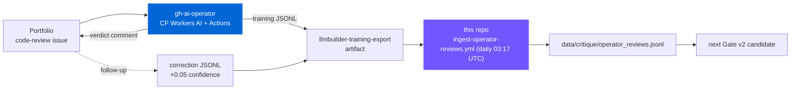
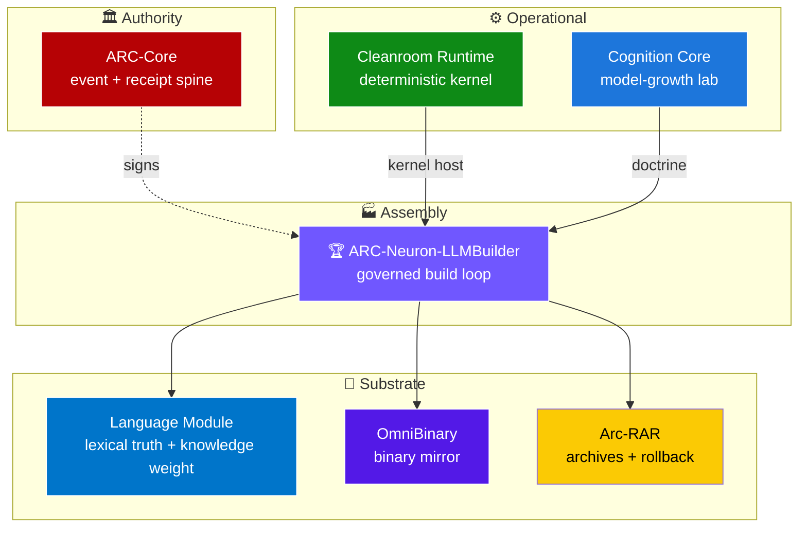
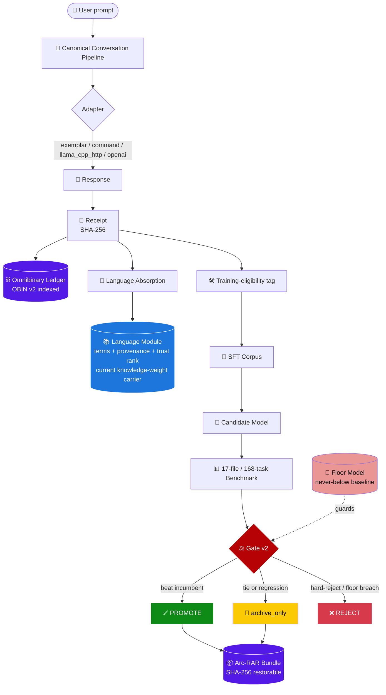
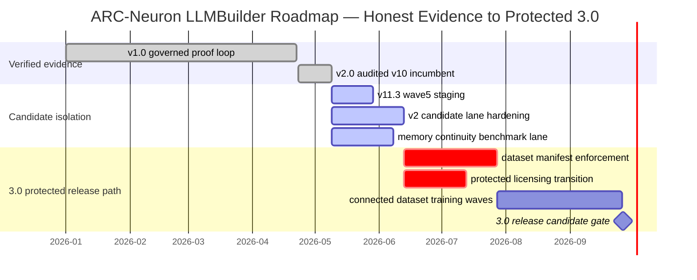

# ARC-Neuron LLMBuilder

**A governed local AI build-and-memory system — train small language models, measure them, promote the better ones through a regression-aware gate, and keep every decision restorable.**

> Local-first. Evidence-backed. Promotion-gated. Rollback-safe. Part of the seven-repo ARC ecosystem.

> 🖥️ **Built, tested, and verified on a 2012 Intel Mac running macOS Catalina.** If it runs there, it runs anywhere. The four governed promotions, the 136-test suite, the Omnibinary throughput numbers, and the 9-step proof workflow were all produced on 12-year-old consumer hardware with a pre-Retina Intel CPU. No GPU. No cloud. No accelerator. Just Python and a lot of discipline.

### 💫 Thanks to our supporters

<a href="https://github.com/GareBear99/ARC-Neuron-LLMBuilder/stargazers">
  
</a>


<sub>**Topics**: local AI • governed AI • GGUF • offline LLM builder • AI provenance • model promotion gate • regression-safe training • ARC Language Module • Omnibinary • Arc-RAR • device-portable AI communication • time-to-space projection • knowledge preservation • ARC-Neuron • offline model governance • reproducible AI</sub>

[](./LICENSE)
[](https://www.python.org/downloads/)
[](./scripts/validate_repo.py)
[](./specs/promotion_gate_v2.yaml)
[](./docs/BENCHMARK_PROOF.md)
[](./RELEASE_NOTES_v1.0.0.md)
[](https://github.com/sponsors/GareBear99)
[](./ECOSYSTEM.md)
[](https://github.com/GareBear99/ARC-Neuron-LLMBuilder/discussions)
[](./PROOF.md#hardware-provenance)
[](./STORAGE_ECONOMICS.md)

## Search / discovery front door

**ARC-Neuron LLMBuilder** is a **local-first AI model builder**, **offline LLM governance lab**, and **GGUF-oriented candidate promotion system** for developers who need reproducible model growth instead of black-box prompt drift. It combines model training, benchmark scoring, memory/continuity tests, promotion gates, Arc-RAR rollback bundles, Omnibinary receipts, dataset manifests, ARC Language Module truth-weighting, device-portable communication/archive mechanics, time-to-space projection planning, and a protected 3.0 roadmap into one auditable repository.

**Best-fit search terms:** `local AI`, `offline LLM`, `GGUF model builder`, `AI provenance`, `model promotion gate`, `regression-safe training`, `AI memory system`, `LLM benchmark harness`, `dataset governance`, `Arc-RAR`, `Omnibinary`, `ARC Language Module`, `device portable AI`, `time to space projection`, `spatial signal intelligence`, `ARC-Neuron`, `Gary Doman`, `GareBear99`.

**Fast links for people and crawlers:**

| Need | Start here |
|---|---|
| Verify current state | [Production evidence status](#production-evidence-status) · [PROOF.md](./PROOF.md) · [docs/PRODUCTION_RELEASE_HANDOFF.md](./docs/PRODUCTION_RELEASE_HANDOFF.md) |
| Understand the system | [What this is](#what-this-is) · [Architecture at a glance](#architecture-at-a-glance) · [ARCHITECTURE.md](./ARCHITECTURE.md) |
| See governance | [The governance doctrine](#the-governance-doctrine) · [specs/promotion_gate_v2.yaml](./specs/promotion_gate_v2.yaml) · [docs/KNOWLEDGE_PRESERVATION_DOCTRINE.md](./docs/KNOWLEDGE_PRESERVATION_DOCTRINE.md) |
| Follow the 3.0 roadmap | [docs/ARC_NEURON_3_0_ROADMAP_INTEGRATION.md](./docs/ARC_NEURON_3_0_ROADMAP_INTEGRATION.md) · [docs/DARPA_NEXT_STEPS_TO_GEMMA_CLAUDE_STATE.md](./docs/DARPA_NEXT_STEPS_TO_GEMMA_CLAUDE_STATE.md) |
| Add datasets safely | [docs/DATASET_ACQUISITION_MATRIX_3_0.md](./docs/DATASET_ACQUISITION_MATRIX_3_0.md) · [configs/datasets/dataset_manifest_template.yaml](./configs/datasets/dataset_manifest_template.yaml) |
| Protect candidate scoring | [docs/V2_CANDIDATE_ISOLATION_POLICY.md](./docs/V2_CANDIDATE_ISOLATION_POLICY.md) · [configs/candidates/v2_class_policy.yaml](./configs/candidates/v2_class_policy.yaml) |
| Test memory continuity | [docs/MODEL_MEMORY_EVALUATION_PROTOCOL.md](./docs/MODEL_MEMORY_EVALUATION_PROTOCOL.md) · [benchmarks/v2_memory_continuity_tasks.jsonl](./benchmarks/v2_memory_continuity_tasks.jsonl) |
| Understand licensing path | [LICENSE](./LICENSE) · [LICENSE_TRANSITIONAL_NOTICE.md](./LICENSE_TRANSITIONAL_NOTICE.md) · [docs/TRANSITIONAL_LICENSE_ROADMAP.md](./docs/TRANSITIONAL_LICENSE_ROADMAP.md) |
| Improve GitHub/Google indexing | [docs/SEO_INDEXING_PLAYBOOK.md](./docs/SEO_INDEXING_PLAYBOOK.md) · [repo-metadata/repository_topics.txt](./repo-metadata/repository_topics.txt) · [docs/seo_metadata.jsonld](./docs/seo_metadata.jsonld) |


## Production evidence status

Current packaged status: `arc_governed_v10_wave4` remains the reproducible incumbent in `results/scoreboard.json`. v11.3 / wave5 materials are treated as a staging candidate until promotion evidence is regenerated from shipped files, Gate v2 passes without protected-floor regression, and the archive bundle/scoreboard are updated.

**Up-to-date rule:** this README intentionally separates verified evidence from roadmap intent. Current proof stays on the reproducible v10 incumbent; new datasets, memory tests, support-language data, and 3.0 licensing changes enter through the v2 candidate lane first so they cannot pollute incumbent scoring.

**Current knowledge-source boundary:** no external third-party dataset pack has been merged into the live incumbent yet. The current repository is still based on self-curated ARC examples, hand-authored benchmarks, receipts, docs, and operator-authored doctrine. External datasets remain roadmap items until they pass manifest, license, hash, quarantine, and v2-candidate isolation checks.

**Language-weight boundary:** the ARC Language Module is the current knowledge/lexical-weight carrier for the stack. It holds terms, provenance, trust ranks, contradiction flags, and source-path continuity. The tiny/small native models prove the governed training loop; the language module carries the growing truth spine until larger v2/v3 candidate weights are trained and promoted with evidence.

**Portable communication boundary:** Omnibinary and Arc-RAR are the cross-device communication and restore layer. Omnibinary mirrors events, receipts, language deltas, and projected state into a compact binary ledger; Arc-RAR packages the same state into restorable archives so another device can receive, replay, verify, and continue from the same source spine.

**Time-to-space projection boundary:** ARC treats time-ordered receipts, observations, prompts, benchmark changes, and spatial/signal references as projectable state. The roadmap keeps time → event → coordinate/space projection as an auditable memory pattern rather than an unverified black-box claim.


### Current packaged verification — 2026-05-09

This production-candidate package was rechecked from the shipped ZIP, not from an assumed working tree.

| Check | Current result |
|---|---:|
| Python compile sweep | PASS |
| Repository validator | PASS |
| JSON/YAML/JSONL schema/load validation | PASS |
| Test modules | 136 / 136 passed when run by module |
| Benchmark inventory | 17 benchmark files / 168 total tasks |
| Reproducible incumbent | `arc_governed_v10_wave4` / 0.9237 |
| v11.3 wave5 | Candidate/staging lane only until regenerated promotion evidence passes Gate v2 |

See `docs/PRODUCTION_RELEASE_HANDOFF.md` and `reports/production_audit/FINAL_COMPLETION_LOCK_2026-05-09.md`.

For the protected 3.0 roadmap, see:

- `docs/KNOWLEDGE_PRESERVATION_DOCTRINE.md`
- `docs/V2_CANDIDATE_ISOLATION_POLICY.md`
- `docs/ARC_NEURON_3_0_ROADMAP_INTEGRATION.md`
- `docs/DATASET_ACQUISITION_MATRIX_3_0.md`
- `docs/DARPA_NEXT_STEPS_TO_GEMMA_CLAUDE_STATE.md`
- `docs/MODEL_MEMORY_EVALUATION_PROTOCOL.md`
- `docs/TRANSITIONAL_LICENSE_ROADMAP.md`
- `LICENSE_TRANSITIONAL_NOTICE.md`


### SEO / public indexing status

This package now includes a dedicated public-indexing layer for discoverability without overstating capability:

- `docs/SEO_INDEXING_PLAYBOOK.md` — GitHub, Pages, release, and external indexing checklist
- `repo-metadata/repository_topics.txt` — recommended GitHub topics
- `repo-metadata/repository_description.txt` — concise repository description
- `docs/seo_metadata.jsonld` — structured metadata for public pages
- `robots.txt` — crawler allowlist for GitHub Pages

Recommended description: **Governed local AI cognition lab for building, benchmarking, and promoting GGUF-oriented model candidates with receipts, rollback, provenance, and regression-safe gates.**


## Table of contents

- [Search / discovery front door](#search--discovery-front-door)
- [Production evidence status](#production-evidence-status)
- [SEO / public indexing status](#seo--public-indexing-status)
- [Live deployment — continuous-learning AI operative](#live-deployment--continuous-learning-ai-operative)
- [Operator evidence log](./docs/OPERATOR_EVIDENCE.md)
- [What this is](#what-this-is)
- [The ARC Ecosystem](#the-arc-ecosystem)
- [Support this work](#support-this-work)
- [What it does, in plain English](#what-it-does-in-plain-english)
- [Current state](#current-state)
- [Quick start](#quick-start)
- [Architecture at a glance](#architecture-at-a-glance)
- [The governance doctrine](#the-governance-doctrine)
- [3.0 protected roadmap and dataset lanes](#30-protected-roadmap-and-dataset-lanes)
- [Benchmark surface](#benchmark-surface)
- [Repository layout](#repository-layout)
- [One-command operations](#one-command-operations)
- [Proof runners](#proof-runners)
- [Documentation](#documentation)
- [Community](#community)
- [Status and scope](#status-and-scope)
- [Citation](#citation)
- [License](#license)

---

## 🤖 Live deployment — continuous-learning AI operative

**A real AI operative feeds this corpus every day.** The [ARC GitHub AI Operator](https://github.com/GareBear99/gh-ai-operator) answers code-review issues on the [Portfolio](https://github.com/GareBear99/Portfolio) via [Cloudflare Workers AI](https://github.com/GareBear99/gh-ai-operator/blob/main/cloudflare/README.md), posts a verdict back on the issue, and emits every production review as a supervised training example in this repo's seed-examples schema. The nightly workflow `ingest-operator-reviews.yml` pulls those artifacts into `data/critique/operator_reviews.jsonl`, dedupes by id, and bumps human-correction records (from Portfolio Follow-up issues) by +0.05 confidence so Gate v2 weights them higher.



Nothing auto-promotes to the curated `seed_examples.jsonl` — ingested data stays in a separate shard so a human curator keeps the final call. Full pipeline: [docs/LIVE_DEPLOYMENT_LEARNING.md](./docs/LIVE_DEPLOYMENT_LEARNING.md). Activation is one secret: `OPERATOR_READ_TOKEN` (PAT with `Actions: Read` on `GareBear99/gh-ai-operator`).

**Live-run evidence**: [docs/OPERATOR_EVIDENCE.md](./docs/OPERATOR_EVIDENCE.md) — chronological log of real runs. First entry (FreeEQ8, Portfolio issue #1) documents the verdict, the JSONL shape, and the ingest manifest with no code changes required to accept it.

---

---

<a id="audit-results"></a>
## 🔬 Independent Audit Results — v10 (2026-05-04)

An independent DARPA-level code audit found 4 structural defects in the original benchmark and rubric,
corrected all of them, and ran 4 consecutive governed promotion cycles. Every result is reproducible.

**True baseline (post-fix): 0.6836 → Current: 0.9237 (+35.1%)**

| Capability | Pre-Audit | v10 |
|-----------|-----------|-----|
| critique | 0.7500 | **1.0000** |
| planning | 0.8571 | **1.0000** |
| repair | 0.6667 | **1.0000** |
| paraphrase_stability | 0.8666 | **1.0000** |
| quantization_retention | 0.6667 | **1.0000** |
| compression | 0.5667 | **0.9167** |
| out_of_domain | 0.7500 | **0.9667** |
| instruction_following | 0.5833 | **0.9250** |
| reasoning | 0.5500 | 0.8833 |
| reflection | 0.5667 | 0.8375 |
| continuity | 0.5833 | 0.7708 |
| **OVERALL** | **0.6836** | **0.9237** |

4 governed promotions | 0 floor failures | 0 severe regressions | repository validator passing

→ [Full audit report](./docs/BENCHMARK_PROOF.md) | [Step-by-step guide](./docs/QUICKSTART_STEPBYSTEP.md) | [How to grow it](./docs/HOW_TO_GROW.md) | [Use cases](./docs/USE_CASES.md)

> **What 0.9237 actually means:** The current model is a TF-IDF retrieval system over 669 stored examples — not a trained neural network. The benchmark tasks are hand-authored engineering prompts; the rubric measures vocabulary patterns that correlate with good answers. These are documented limitations, not hidden ones. The score represents the honest ceiling of the exemplar architecture. The transformer layer (`arc_core/transformer.py`) is the next step. See [docs/BENCHMARK_PROOF.md §8 Known Limitations](./docs/BENCHMARK_PROOF.md) for the full statement.

---

<a id="what-this-is"></a>
## What this is

> **Honest status, patched package:** this repository is best described as a **governed alpha cognition lab / proof-of-loop package**. The governance, receipts, benchmark, native tiny/small model, GGUF export, and promotion machinery are real. The included model tiers are intentionally small reference brains, not frontier-scale replacements for Claude/GPT/Gemini.

ARC-Neuron LLMBuilder is a local-first cognition lab that treats a language model as one artifact inside a **governed lifecycle**. You don't just train a model — you train a candidate, measure it, compare it to the current incumbent, and promote it only if it genuinely improves without regressing on guarded capabilities. Every decision leaves receipts. Every candidate is restorable. Every archive ties back to the source truth through an indexed binary ledger.

The current public stack is intentionally honest about where the intelligence lives today: the **ARC Language Module carries the live lexical/knowledge weight**, while the included Tiny/Small model tiers and exemplar adapter prove the build → benchmark → promote loop. No external dataset wave has been promoted into the incumbent yet; the 3.0 dataset program is a governed roadmap, not a hidden bundled corpus.

Omnibinary and Arc-RAR make the system portable: a device does not need to inherit a vague chat history — it can receive binary-indexed receipts, language deltas, archive bundles, and replayable state. That is the foundation for ARC-style communication across machines, offline systems, old hardware, and future spatial/time-projection modules.

The system ships with a working transformer family (ARC-Neuron Tiny and Small), a retrieval-based exemplar adapter, a canonical conversation pipeline, draft→critique→revise reflection, automatic terminology absorption from conversation, and a regression-aware promotion gate.

**Governed proof loop:** conversation data can feed the training/evaluation pipeline; promotion remains gated by evidence and human-curated shards. Three governed promotions recorded through v1.0.0. **Post-audit (v2.0.0):** four additional governed promotions (v7→v10) raised the verified score from 0.6836 to 0.9237 (+35.1%) after independent audit corrected 4 structural defects in the benchmark and rubric.

---

## 🌐 The ARC Ecosystem

ARC-Neuron LLMBuilder is **one of seven repositories** in the ARC governed-AI ecosystem. Each repo owns a single frozen role; together they form a local-first AI operating system with full lineage, receipts, and rollback.



Brief tour of each (full writeups in [ECOSYSTEM.md](./ECOSYSTEM.md)):

### [ARC-Core](https://github.com/GareBear99/ARC-Core) — authoritative event-and-receipt engine
The root authority. Every state change across the system is modeled as an event with a proposal, evidence, an authority, a receipt, and a SHA-256 hash. This is how the ecosystem proves *something actually happened*. It also carries the signal-intelligence event-graph primitives (cases, watchlists, risk scoring) that give operators a structured way to organize investigations over the event stream.

### [arc-lucifer-cleanroom-runtime](https://github.com/GareBear99/arc-lucifer-cleanroom-runtime) — deterministic execution kernel
The deterministic shell the rest of the system eventually runs inside. Event-sourced `KernelEngine` with an append-only log, policy evaluation, branch planning, point-in-time `state_at(event_id)` replay, SQLite backup, directive continuity across restarts. LLMs are stochastic; Cleanroom is the deterministic substrate that makes the rest of the system reproducible.

### [arc-cognition-core](https://github.com/GareBear99/arc-cognition-core) — cognition build-and-benchmark lab
The upstream home of the cognition doctrine: candidate shaping (SFT / preference / merge / export), GGUF-oriented evaluation, promotion gate v1 (what LLMBuilder's Gate v2 evolved from), MCP-style tool descriptors, run manifests, experiment tracking, release bundle generation. Defines what "a cognition candidate" means.

### [arc-language-module](https://github.com/GareBear99/arc-language-module) — governed multilingual language backend
The authoritative store for what a word means, how it is spelled, what it maps to across languages, and where each of those facts came from. Governed ingestion with provenance + trust rank, readiness/gap states, self-fill orchestration with approval gates, contradiction arbitration, release pipelines with replayable snapshots. 40+ internal services. Treats words as first-class governed records, not strings.

### [omnibinary-runtime](https://github.com/GareBear99/omnibinary-runtime) — native-first binary intake and runtime ledger
Applies the receipt economy to binaries. Intake + classification + deterministic decoding of executables, libraries, GGUF weights, ANCF artifacts. Federated execution lanes (managed / native / DBT) each with their own policy and receipts. JIT via Cranelift and LLVM. Cache-integrity-before-speed policy. Rust crates: `obi-core`, `obi-cache`, `obi-intake`, `obi-jit-*`, `obi-lane-*`, `obi-receipts`, and more.

### [Arc-RAR](https://github.com/GareBear99/Arc-RAR) — governed archive and rollback
CLI-first archive manager with a native-app control surface (Linux GTK, macOS, Windows WinUI). Bundles are manifest-indexed and SHA-256-verified; the manifest is readable without extracting. Extraction is evidence-producing — every restore leaves a receipt. Automation crate, FFI crate, IPC crate for daemon mode. Any archived state is addressable by SHA-256; rollback is first-class, not a recovery special case.

### ARC-Neuron-LLMBuilder *(this repo)* — governed build loop
Assembly of the other six into a working train → benchmark → gate → archive → verify cycle. Canonical conversation pipeline, Gate v2 promotion, floor model, reflection loop, language absorption, OBIN v2 indexed ledger, Arc-RAR bundle packaging. **Four post-audit governed promotions on record (v7, v8, v9, v10).** 136 tests. 165-task benchmark suite (rebuilt and verified).

Full per-repo writeups, integration flow, and role contract: **[ECOSYSTEM.md](./ECOSYSTEM.md)**

---

## 💖 Support this work

If the governance doctrine, the conversation-driven growth loop, or the evidence-backed promotion pipeline is useful to you or your organization, please consider becoming a sponsor:

[**github.com/sponsors/GareBear99**](https://github.com/sponsors/GareBear99)

Sponsorship funds time across all seven ARC ecosystem repos — not just this one.

---

## 💡 What it does, in plain English

| You do | The system does |
|---|---|
| Talk to it | Records the conversation with a signed receipt, mirrors it into the Omnibinary indexed ledger, extracts terminology with provenance |
| Ask it to train a new model | Mines the accumulated SFT corpus, trains a byte-level transformer, exports `.pt` + `.gguf`, builds a retrieval exemplar artifact |
| Ask it to compare | Runs the candidate against the verified benchmark inventory (17 benchmark files / 168 total tasks), scores with the task-aware rubric, and prints per-capability deltas |
| Ask it to promote | Applies Gate v2 (hard-reject floor, floor-model protection, regression ceilings), updates the scoreboard, bundles the candidate into an Arc-RAR archive |
| Ask it to roll back | Restores a prior incumbent from its bundle; the prior state is always addressable by SHA-256 |
| Ask it to prove itself | Runs `demo_proof_workflow.py` or `run_n_cycles.py` — every step produces a receipt |

---

## 📊 Current state

<table>
<tr>
<td width="50%">

### 🟢 Operational

- **✅ Validator**: `python3 scripts/validate_repo.py` passing in this package
- **🧪 Tests**: PyTorch smoke tests are included; run locally with `python3 -m pytest tests -q`
- **🏆 Incumbent**: `arc_governed_v10_wave4`
- **📈 Score**: **0.9237** for the reproducible v10 incumbent on the post-audit benchmark surface
- **📚 Docs**: 26 root markdown files + 80 docs markdown files in this package
- **📦 Bundles**: 12 restorable
- **💾 Pipeline**: Canonical, single-path

</td>
<td width="50%">

### ⚡ Performance (measured)

- **✍️ Append**: **6,639 ev/sec**
- **🔎 Lookup**: **8,859 O(1) ops/sec**
- **📐 p99 latency**: **~0.35 ms** (Omnibinary lookup) · validator passing
- **💾 Per-event**: **397 bytes**
- **🗄️ Per TB**: **~2.71 billion events**
- **📍 Fidelity**: SHA-256 stable ✅

</td>
</tr>
</table>

### 🎯 Promotion lineage

```
v1 (0.6122) → v2 (0.6247) → v4 (0.7128) → v5 (0.7169) → v6 (0.6836†) → v7 (0.8537) → v8 (0.8883) → v9 (0.8911) → **v10 (0.9237)**  🏆

†v6 true baseline after audit remediation. Pre-audit claimed 0.7333 (inflated by synthetic benchmarks).
   promote         promote         promote         promote         promote / INCUMBENT
                                   +35.1% net improvement from true v6 baseline through 4 governed audit cycles
```

Plus: **v6 tied ⇒ archive_only** · **v7_regressed caught ⇒ archive_only** · **5/5 STABLE** at v5 floor.

Post-audit: **4/4 PROMOTE** across waves 1–4 · **0 floor failures** · **0 severe regressions**.

All four Gate v2 decision states have fired lawfully on real runs. Every claim above is individually verifiable:

- 🔬 [PROOF.md](./PROOF.md) — every number with its receipt and verification command
- 💾 [STORAGE_ECONOMICS.md](./STORAGE_ECONOMICS.md) — year-long projections + ChatGPT / Claude / Gemini comparison
- 📜 [RELEASE_NOTES_v1.0.0.md](./RELEASE_NOTES_v1.0.0.md) — full release dossier

---

## 🚀 Quick start

### 1. Install

#### Option A — pip (Python 3.10+)

```bash
git clone https://github.com/GareBear99/ARC-Neuron-LLMBuilder.git
cd ARC-Neuron-LLMBuilder

python3.12 -m venv .venv
source .venv/bin/activate
pip install -e ".[training]"         # installs core + torch + numpy
python3 scripts/ops/bootstrap_keys.py
```

#### Option B — Docker (zero setup)

```bash
git clone https://github.com/GareBear99/ARC-Neuron-LLMBuilder.git
cd ARC-Neuron-LLMBuilder
docker build -t arc-neuron-llmbuilder .
docker run --rm arc-neuron-llmbuilder python3 scripts/ops/demo_proof_workflow.py
```

### 2. Validate

```bash
python3 -m pytest tests/ -q              # 136 tests
python3 scripts/ops/benchmark_omnibinary.py   # measures the ledger
python3 scripts/ops/demo_proof_workflow.py    # 9-step end-to-end proof
```

### 3. Use the incumbent model

**Shortest possible — one line:**

```bash
python3 examples/hello.py "Critique a plan that ships without a rollback path."
```

**Full CLI equivalent:**

```bash
python3 scripts/execution/run_direct_candidate.py \
  --adapter exemplar \
  --artifact exports/candidates/arc_governed_v10_wave4/exemplar_train/exemplar_model.json \
  --prompt "Critique a plan that ships without a rollback path."
```

### 4. Train your own candidate

```bash
# Train a new candidate against the current corpus
python3 scripts/training/train_arc_native_candidate.py \
  --candidate my_candidate_v1 --tier small --steps 300

# Benchmark it
python3 scripts/execution/run_model_benchmarks.py \
  --adapter exemplar \
  --artifact exports/candidates/my_candidate_v1/exemplar_train/exemplar_model.json \
  --output results/my_candidate_v1_outputs.jsonl

# Score it
python3 scripts/execution/score_benchmark_outputs.py \
  --input results/my_candidate_v1_outputs.jsonl \
  --output results/my_candidate_v1_scored.json

# Submit to Gate v2 — promote, archive-only, or reject with reasons
python3 scripts/execution/promote_candidate.py \
  --scored results/my_candidate_v1_scored.json \
  --model-name my_candidate_v1 \
  --candidate my_candidate_v1
```

### 5. Run the full governed loop

```bash
make full-loop       # train → benchmark → score → gate → bundle → verify
make pipeline        # run one conversation through the canonical path
make verify-store    # check Omnibinary integrity
```

---

## 🏗️ Architecture at a glance



**Four layers, frozen roles**:

- **Language Module** — living truth spine and current knowledge-weight carrier. Stores terms with provenance, trust ranks, contradiction flags, source paths, and lexical continuity. Today this layer carries the meaningful parameter/knowledge weight because external datasets have not yet been promoted into live model weights.
- **Runtime** — persistent operator shell. Canonical conversation pipeline, reflection loop, language absorption, continuity state.
- **Cognition Core** — build-and-benchmark lab. Native training, exemplar adapter, benchmark harness, scoring rubric, promotion gate.
- **Archive / communication layer** — Arc-RAR bundles for restorable lineage; Omnibinary ledger for O(1) indexed event history, language deltas, receipts, and compact cross-device replay. This is the device-portable layer that lets another machine verify and continue the same source spine.

**Time-to-space projection note:** ARC's roadmap treats chronological receipts as more than logs. Events can be projected into spatial coordinates, signal maps, frame snapshots, robotics/perception memories, or blueprint-style state views. Omnibinary preserves the ordered event substrate; Arc-RAR preserves the restorable package; the Language Module preserves the meaning layer that explains what each projected state represents.

See [ARCHITECTURE.md](./ARCHITECTURE.md) and [GOVERNANCE_DOCTRINE.md](./GOVERNANCE_DOCTRINE.md) for the full map.

---

## ⚖️ The governance doctrine

Every candidate must clear **Gate v2** before displacing an incumbent:

1. **Hard-reject floor** — `repair_success` ≥ 0.30, `failure_rate` ≤ 0.25
2. **Floor model check** — core capabilities cannot drop below 95% of the incumbent baseline (currently v10_wave4)
3. **Regression ceilings** — no guarded capability may drop more than its per-capability allowance vs the incumbent
4. **Beat the incumbent** on overall weighted score
5. **Non-promotable adapter filter** — heuristic/echo adapters can never become incumbents

Outcomes are one of: **promote**, **archive_only**, or **reject**. Every outcome produces a receipt. `archive_only` and `reject` never displace the current incumbent. `promote` bundles the winning candidate via Arc-RAR, preserving the full lineage.

Full spec: [specs/promotion_gate_v2.yaml](./specs/promotion_gate_v2.yaml), [specs/benchmark_schema_v2.yaml](./specs/benchmark_schema_v2.yaml)

---

## 🗺️ Roadmap

Live roadmap. Updated to keep the public README aligned with the current package state and the protected 3.0 direction. Full detail lives in [ROADMAP.md](./ROADMAP.md), [docs/ARC_NEURON_3_0_ROADMAP_INTEGRATION.md](./docs/ARC_NEURON_3_0_ROADMAP_INTEGRATION.md), and [docs/TRANSITIONAL_LICENSE_ROADMAP.md](./docs/TRANSITIONAL_LICENSE_ROADMAP.md).

| Track | Status | Purpose | Key deliverables |
|---|---|---|---|
| **v1.0 governed** | ✅ Historical shipped release | Original governed proof loop | Gate v2, receipts, OBIN ledger, Arc-RAR bundles, release evidence |
| **v2.0 audited / v10 incumbent** | ✅ Current reproducible incumbent | Honest post-audit benchmark floor | `arc_governed_v10_wave4`, 0.9237 score, 136 tests, validated production evidence |
| **v11.3 / wave5** | 🚧 Candidate/staging | Expanded SFT and candidate growth experiments | Must regenerate promotion evidence and pass Gate v2 before becoming incumbent |
| **v2 candidate class** | ✅ Policy added | Isolate new weights/data from incumbent scoring | candidate namespace, dataset manifests, memory-continuity benchmark lane |
| **3.0 roadmap integration** | 🎯 Protected target | Full base-model roadmap with connected datasets and stronger license posture | governed datasets, memory tests, preservation doctrine, transitional license path, commercial protections |
| **External/local model adapters** | 🔮 Planned/ongoing | Let stronger local GGUF or HTTP-served models run through the same governance shell | adapter scoreboards, per-backend receipts, no direct incumbent overwrite |
| **Ecosystem federation** | 🔮 Planned/ongoing | Bind ARC-Core, Cleanroom Runtime, Language Module, Omnibinary, and Arc-RAR into one auditable loop | co-signed receipts, replay bundles, binary/source truth latching |

### Progress toward each milestone



### How to influence what ships

- File a [✨ feature request](./.github/ISSUE_TEMPLATE/02_feature_request.yml) tagged with the target track.
- Open a PR that preserves all ten [governance invariants](./GOVERNANCE_DOCTRINE.md).
- Add datasets only through manifest + license + hash + candidate-lane approval.
- [💖 Sponsor](https://github.com/sponsors/GareBear99) to fund maintenance time across the whole ARC ecosystem.
- Discuss architectural direction in [💬 GitHub Discussions](https://github.com/GareBear99/ARC-Neuron-LLMBuilder/discussions).

### Explicit boundaries

❌ Not a frontier-scale Claude/Gemini replacement today · ❌ No external dataset wave promoted into the incumbent yet · ❌ No direct overwrite of the incumbent from new weights · ❌ No unmanifested dataset ingestion · ❌ No hidden promotion without receipts · ❌ No false claim that v11.3 is promoted until reproducible Gate v2 evidence proves it.

---

## 3.0 protected roadmap and dataset lanes

The 3.0 track is the full roadmap integration release: stronger candidate training, connected datasets, memory-continuity evaluation, provenance preservation, and a more protective licensing posture. It is **not** allowed to overwrite the current incumbent lane directly.

### Candidate isolation law

New weights, new datasets, and new support-language/mental-health-style corpora enter through the **v2 candidate class** first. They are measured separately, compared against the v10 incumbent, and promoted only if Gate v2 shows no protected-floor regression.

- Policy: [docs/V2_CANDIDATE_ISOLATION_POLICY.md](./docs/V2_CANDIDATE_ISOLATION_POLICY.md)
- Config: [configs/candidates/v2_class_policy.yaml](./configs/candidates/v2_class_policy.yaml)
- Knowledge doctrine: [docs/KNOWLEDGE_PRESERVATION_DOCTRINE.md](./docs/KNOWLEDGE_PRESERVATION_DOCTRINE.md)

### Dataset roadmap

The dataset roadmap is documented as governed acquisition lanes, not as unreviewed bundled data. **No external dataset wave is currently promoted into the incumbent.** Current live knowledge is self-curated ARC material: docs, hand-authored examples, benchmark prompts, receipts, and operator-authored doctrine. Every future dataset needs source, license, hash, intended use, risk level, transform record, quarantine status, and approval lane before it can train a candidate.

| Dataset lane | Purpose | First landing zone |
|---|---|---|
| ARC-native receipts and docs | Preserve identity, doctrine, rollback, and source-of-truth reasoning | highest-trust curated shard |
| ARC Language Module expansions | Carry lexical truth, parameter/knowledge weight, provenance, trust ranks, contradiction flags, and source-path continuity | self-curated truth spine first; v2 candidate only when converted into training data |
| General instruction following | Improve assistant behavior and task completion | v2 candidate |
| Reasoning / planning / critique-revise | Improve multi-step usefulness and self-checking | v2 candidate |
| Lexical simplicity / support-language | Improve plain-English clarity, empathy, and de-escalation without becoming therapy AI | v2 candidate + safety review |
| Code / tool-use / repo repair | Improve engineering execution, patch planning, and audit behavior | v2 candidate |
| License / refusal / provenance | Protect 3.0 commercial release and prevent bad ingestion | governance/safety shard |
| Memory continuity | Test whether repeated questions preserve doctrine and decisions | v2 benchmark lane |

### Explicit external dataset candidates discussed

These are the **exact open-source dataset/source candidates currently named on the acquisition roadmap**. They are not bundled in this repository, not promoted into the incumbent, and not counted as current training truth. The current live repo remains self-curated ARC material plus hand-authored examples/benchmarks/receipts. Each candidate below must pass license review, dataset-card review, hash capture, quarantine staging, transform receipts, and v2 candidate isolation before training. Links are included for traceability so reviewers can verify the source, dataset card, license, and intended use before anything becomes model influence.

| Exact dataset / source candidate | Official link | Why it is on the roadmap | Use status | First allowed lane |
|---|---|---|---|---|
| **FLAN Collection / FLAN-style instruction tuning** | [google-research/FLAN](https://github.com/google-research/FLAN) · [Flan v2 README](https://github.com/google-research/FLAN/blob/main/flan/v2/README.md) · [Google Research blog](https://research.google/blog/the-flan-collection-advancing-open-source-methods-for-instruction-tuning/) | Broad instruction-following, task formatting, mixed prompt settings, and general assistant behavior | acquisition target only; not bundled; not ingested; license/card review required | v2 candidate instruction lane |
| **OpenAssistant OASST1** | [OpenAssistant/oasst1 on Hugging Face](https://huggingface.co/datasets/OpenAssistant/oasst1) · [LAION-AI/Open-Assistant](https://github.com/LAION-AI/Open-Assistant) | Human-style multi-turn assistant dialogue, user intent handling, critique/reply structure, alignment-style conversation trees | acquisition target only; not bundled; not ingested; license/card review required | v2 candidate dialogue lane |
| **UltraChat / UltraChat 200k** | [HuggingFaceH4/ultrachat_200k](https://huggingface.co/datasets/HuggingFaceH4/ultrachat_200k) · [THUNLP/UltraChat](https://github.com/thunlp/UltraChat) | Larger chat coverage, conversational variety, long-form assistant answers, instruction-following breadth | acquisition target only; not bundled; not ingested; license/card review required | v2 candidate dialogue lane |
| **MentalChat16K / mental-health support-language data** | [ShenLab/MentalChat16K on Hugging Face](https://huggingface.co/datasets/ShenLab/MentalChat16K) · [PennShenLab/MentalChat16K](https://github.com/PennShenLab/MentalChat16K) · [arXiv:2503.13509](https://arxiv.org/abs/2503.13509) | Lexical simplicity, reflective language, emotional tone, de-escalation, supportive phrasing; **not** therapy authority | candidate only; not bundled; not ingested; sensitive-data and safety review mandatory | v2 candidate safety-reviewed support-language lane |
| **WikiLarge / text simplification data** | [waboucay/wikilarge](https://huggingface.co/datasets/waboucay/wikilarge) · [eilamc14/wikilarge-clean](https://huggingface.co/datasets/eilamc14/wikilarge-clean) · [bogdancazan/wikilarge-text-simplification](https://huggingface.co/datasets/bogdancazan/wikilarge-text-simplification) | Plain-language rewriting, lexical simplification, clearer explanations without dropping technical truth | acquisition target only; not bundled; not ingested; quality/noise review required | v2 candidate lexical-clarity lane |
| **GSM8K** | [openai/gsm8k on Hugging Face](https://huggingface.co/datasets/openai/gsm8k) | Multi-step grade-school math word problems for reasoning, decomposition, and answer checking | acquisition/eval target only; not bundled; not ingested | v2 candidate reasoning/eval lane |
| **MBPP — Mostly Basic Python Problems** | [google-research MBPP](https://github.com/google-research/google-research/tree/master/mbpp) · [Muennighoff/mbpp mirror](https://huggingface.co/datasets/Muennighoff/mbpp) | Basic Python problem-solving, code synthesis, function-level reasoning, test-aware engineering behavior | acquisition/eval target only; not bundled; not ingested; license/source review required | v2 candidate engineering/eval lane |
| **OpenAI HumanEval** | [openai/human-eval](https://github.com/openai/human-eval) · [openai/openai_humaneval on Hugging Face](https://huggingface.co/datasets/openai/openai_humaneval) | Python code-generation evaluation with unit tests; useful as an eval gate, not primary training truth | eval target only; not bundled; not ingested into training by default | code-eval gate / v2 engineering benchmark lane |
| **BigCode The Stack / permissively licensed code data** | [bigcode/the-stack](https://huggingface.co/datasets/bigcode/the-stack) · [BigCode The Stack docs](https://www.bigcode-project.org/docs/about/the-stack/) · [bigcode/the-stack-v2](https://huggingface.co/datasets/bigcode/the-stack-v2) | Large-scale source-code acquisition candidate for C/C++/Python/tooling awareness with provenance and license metadata | high-risk/large target only; not bundled; not ingested; per-file license/provenance rules mandatory | quarantined code-acquisition lane before v2 candidate use |
| **ARC-native operator corrections and production review logs** | [docs/LIVE_DEPLOYMENT_LEARNING.md](./docs/LIVE_DEPLOYMENT_LEARNING.md) · [docs/OPERATOR_EVIDENCE.md](./docs/OPERATOR_EVIDENCE.md) | Highest-trust growth data from this ecosystem's docs, failures, fixes, receipts, and operator corrections | self-curated lane active; external promotion not involved | curated ARC truth spine; v2 when converted into training shards |
| **Memory / continuity regression tasks** | [benchmarks/v2_memory_continuity_tasks.jsonl](./benchmarks/v2_memory_continuity_tasks.jsonl) · [configs/evaluation/memory_regression_suite.yaml](./configs/evaluation/memory_regression_suite.yaml) | Test whether roadmap decisions, licensing doctrine, candidate isolation, and provenance rules stay stable across repeated questions | benchmark lane added; not model-ingested as external data | v2 benchmark/eval lane |

**Dataset rule:** the roadmap can name external datasets, but the repo must not pretend they are already inside the model. The ARC Language Module currently carries the live lexical/knowledge weight; future datasets only become model-weight influence after governed ingestion and clean promotion evidence.

- Dataset matrix: [docs/DATASET_ACQUISITION_MATRIX_3_0.md](./docs/DATASET_ACQUISITION_MATRIX_3_0.md)
- Manifest template: [configs/datasets/dataset_manifest_template.yaml](./configs/datasets/dataset_manifest_template.yaml)
- Memory protocol: [docs/MODEL_MEMORY_EVALUATION_PROTOCOL.md](./docs/MODEL_MEMORY_EVALUATION_PROTOCOL.md)
- DARPA-style climb plan: [docs/DARPA_NEXT_STEPS_TO_GEMMA_CLAUDE_STATE.md](./docs/DARPA_NEXT_STEPS_TO_GEMMA_CLAUDE_STATE.md)
- 3.0 roadmap: [docs/ARC_NEURON_3_0_ROADMAP_INTEGRATION.md](./docs/ARC_NEURON_3_0_ROADMAP_INTEGRATION.md)
- License transition: [docs/TRANSITIONAL_LICENSE_ROADMAP.md](./docs/TRANSITIONAL_LICENSE_ROADMAP.md)

## 📈 Benchmark surface

17 benchmark files / 168 total tasks in this package. The v10 incumbent score remains the current reproducible public proof point:

| Family | Tasks | v10 score |
|---|---|---|
| reasoning | 10 | 0.8833 |
| planning | 10 | 1.0000 |
| compression | 10 | 0.9167 |
| paraphrase_stability | 10 | 1.0000 |
| calibration | 10 | 0.9000 |
| english_understanding | 10 | 0.9000 |
| critique | 10 | 1.0000 |
| out_of_domain | 10 | 0.9667 |
| quantization_retention | 10 | 1.0000 |
| repair | 10 | 1.0000 |
| instruction_following | 10 | 0.9250 |
| intelligence | 12 | 0.8472 |
| continuity | 10 | 0.7708 |
| reflection | 10 | 0.8375 |

---

## 📂 Repository layout

```
ARC-Neuron-LLMBuilder/
├── arc_core/              # Single canonical transformer implementation
├── arc_tiny/              # Tiny tier (~0.05M params) + GGUF v3 I/O
├── arc_neuron_small/      # Small tier (~0.18M params)
├── arc_neuron_tokenizer/  # Hybrid byte + wordpiece tokenizer builder
├── adapters/              # Model backend abstraction (exemplar, command, llama_cpp_http, openai)
├── runtime/               # Canonical pipeline, reflection, absorption, terminology, floor model
├── scorers/               # Task-aware rubric scorer with 23 capability buckets
├── scripts/
│   ├── training/          # Native training, LoRA routing, corpus prep
│   ├── execution/         # Benchmark, score, promote, candidate gate
│   ├── ops/               # Proof workflows, repeatability runners, distillation waves
│   ├── lab/               # Tiny/Small GGUF smoke and validate
│   └── operator/          # User-facing shell scripts
├── benchmarks/            # 17 benchmark files / 168 total tasks, including v2 memory-continuity lane
├── datasets/              # Seed and distilled SFT corpora
├── specs/                 # Gate v2, benchmark schema v2, promotion doctrine
├── configs/               # Base model candidates, training stages, runtime profiles
├── reports/               # Promotion receipts, repeatability reports, benchmark numbers
├── artifacts/             # GGUF models, Arc-RAR bundles, Omnibinary ledger
├── exports/candidates/    # Trained candidate artifacts (per-candidate directories)
├── results/               # Benchmark outputs, scored summaries, scoreboard
├── tests/                 # 136-test suite covering the full loop
└── docs/                  # Extended design documentation (62 markdown files)
```

---

## ⚙️ One-command operations

```bash
make validate          # validate repo structure and required files
make test              # run the 136-test suite
make counts            # count datasets and benchmarks
make candidate-gate    # run the full candidate gate
make native-tiny       # train an ARC-Tiny candidate (~0.05M params)
make native-small      # train an ARC-Small candidate (~0.18M params)
make full-loop         # train → benchmark → score → gate → bundle → verify
make pipeline          # run one conversation through the canonical path
make bootstrap-keys    # generate runtime secrets (idempotent)
make bundle-candidate CANDIDATE=<name>   # Arc-RAR bundle a promoted candidate
make verify-store      # verify Omnibinary ledger integrity
```

---

## 🔬 Proof runners

```bash
# 9-step end-to-end proof: term → conversation → train → benchmark → gate → archive
python3 scripts/ops/demo_proof_workflow.py

# Measure Omnibinary throughput, latency, and fidelity
python3 scripts/ops/benchmark_omnibinary.py

# Run N governed promotion cycles and emit a repeatability verdict
python3 scripts/ops/run_n_cycles.py --cycles 3 --tier small --steps 300

# Generate draft→critique→revise SFT pairs from the incumbent
python3 scripts/ops/generate_reflection_sft.py

# Absorb a conversation session end-to-end into the learning pipeline
python3 scripts/ops/absorb_session.py --text "..." --session-id my_session
```

---

## 📚 Documentation

### Core docs
- [ARCHITECTURE.md](./ARCHITECTURE.md) — the full system map; four frozen roles
- [GOVERNANCE_DOCTRINE.md](./GOVERNANCE_DOCTRINE.md) — Gate v2, floor model, Arc-RAR, Omnibinary explained
- [ECOSYSTEM.md](./ECOSYSTEM.md) — the seven-repo ARC ecosystem and how LLMBuilder integrates
- [QUICKSTART.md](./QUICKSTART.md) — 10-minute tour of every major capability
- [docs/QUICKSTART_STEPBYSTEP.md](./docs/QUICKSTART_STEPBYSTEP.md) — **10-step guide from clone to governed promotion** (new)
- [docs/BENCHMARK_PROOF.md](./docs/BENCHMARK_PROOF.md) — **full audit proof with reproducible commands** (new)
- [docs/HOW_TO_GROW.md](./docs/HOW_TO_GROW.md) — **growth path: retrieval → transformer → RLHF → edge** (new)
- [docs/USE_CASES.md](./docs/USE_CASES.md) — **domain applications: robotics, medical, finance, edge**
- [docs/KNOWLEDGE_PRESERVATION_DOCTRINE.md](./docs/KNOWLEDGE_PRESERVATION_DOCTRINE.md) — preserve provenance, lineage, receipts, source paths, and rollback evidence
- [docs/V2_CANDIDATE_ISOLATION_POLICY.md](./docs/V2_CANDIDATE_ISOLATION_POLICY.md) — keep new weights/datasets out of incumbent scoring until proven
- [docs/ARC_NEURON_3_0_ROADMAP_INTEGRATION.md](./docs/ARC_NEURON_3_0_ROADMAP_INTEGRATION.md) — protected 3.0 roadmap integration
- [docs/DATASET_ACQUISITION_MATRIX_3_0.md](./docs/DATASET_ACQUISITION_MATRIX_3_0.md) — governed dataset lanes and risk checks
- [docs/MODEL_MEMORY_EVALUATION_PROTOCOL.md](./docs/MODEL_MEMORY_EVALUATION_PROTOCOL.md) — repeated-question memory/continuity evaluation
- [USAGE.md](./USAGE.md) — complete command reference
- [EXAMPLES.md](./EXAMPLES.md) — 10 runnable recipes

### Reference
- [PROOF.md](./PROOF.md) — every claim with its receipt and verification command
- [STORAGE_ECONOMICS.md](./STORAGE_ECONOMICS.md) — measured storage numbers, year-long projections, vs ChatGPT / Claude / Gemini
- [FAQ.md](./FAQ.md) — 20+ searchable questions
- [GLOSSARY.md](./GLOSSARY.md) — every ARC-specific term
- [ROADMAP.md](./ROADMAP.md) — release trajectory and candidate milestones
- [docs/DARPA_NEXT_STEPS_TO_GEMMA_CLAUDE_STATE.md](./docs/DARPA_NEXT_STEPS_TO_GEMMA_CLAUDE_STATE.md) — staged path toward stronger assistant behavior
- [docs/TRANSITIONAL_LICENSE_ROADMAP.md](./docs/TRANSITIONAL_LICENSE_ROADMAP.md) — 1.0 → transitional bridge → protected 3.0 plan
- [docs/SEO_INDEXING_PLAYBOOK.md](./docs/SEO_INDEXING_PLAYBOOK.md) — GitHub/Google discoverability checklist
- [COMPARISON.md](./COMPARISON.md) — vs MLflow, W&B, Langfuse, llama.cpp
- [MODEL_CARD_v10_wave4.md](./MODEL_CARD_v10_wave4.md) — **current incumbent** (v2.0.0-audited)
- [MODEL_CARD_v6_conversation.md](./MODEL_CARD_v6_conversation.md) — v1.0.0 incumbent (superseded)

### Release
- [CHANGELOG.md](./CHANGELOG.md) — full release history
- [RELEASE_NOTES_v1.0.0.md](./RELEASE_NOTES_v1.0.0.md) — v1.0.0-governed evidence dossier

### Community
- [CONTRIBUTING.md](./CONTRIBUTING.md) — how to contribute
- [CODE_OF_CONDUCT.md](./CODE_OF_CONDUCT.md) — community standards
- [SECURITY.md](./SECURITY.md) — security contact and disclosure
- [`docs/`](./docs/) — 62 extended design docs covering every subsystem (see [docs/README.md](./docs/README.md) for the topic index)

## 👥 Community

- 💬 [GitHub Discussions](https://github.com/GareBear99/ARC-Neuron-LLMBuilder/discussions) — ask questions, share runs, propose directions
- 🐛 [Issues](https://github.com/GareBear99/ARC-Neuron-LLMBuilder/issues) — bug reports, feature requests, gate behavior reports, benchmark contributions
- 🔒 [Security advisories](https://github.com/GareBear99/ARC-Neuron-LLMBuilder/security/advisories/new) — private disclosure
- 💖 [Sponsor](https://github.com/sponsors/GareBear99) — support the ecosystem
- 📦 [Releases](https://github.com/GareBear99/ARC-Neuron-LLMBuilder/releases) — all versions with evidence bundles

---

## 📌 Status and scope

**What this is**: a local-first governed cognition lab and control plane for training, promoting, and archiving small language models with full lineage. The included native models (Tiny and Small) are reference tiers designed to prove the pipeline is real, while the ARC Language Module carries the current live lexical/knowledge weight.

**What this is not**: a frontier-scale LLM today. The ARC-Neuron Tiny model is ~0.05M parameters. The Small model is ~0.18M parameters. They are deliberately small because the current public contribution is the **governance loop plus language-truth spine**, not a Claude/Gemini-class raw brain. No external datasets are promoted into the incumbent yet beyond self-curated ARC material. The 3.0 roadmap is where connected datasets, stronger candidate classes, and protected release terms enter.

**The shell is contender-grade. The brain is the research lane.** The adapter boundary is the integration point: you can plug any local GGUF runtime or HTTP-served model into the existing governance machinery via `adapters/command_adapter.py` or `adapters/llama_cpp_http_adapter.py`.

---

## 🔭 Language weight, portable memory, and time-to-space projection

ARC-Neuron should be read as a governed stack, not just a tiny model checkpoint. Today, the **Language Module carries the live knowledge weight**: terminology, source paths, trust ranks, contradiction records, and the evidence chain behind each learned concept. The current native weights are proof-of-loop reference models; larger v2/v3 candidate weights are not allowed to claim that language knowledge until they are trained, benchmarked, and promoted with receipts.

**Omnibinary + Arc-RAR enable device-portable communication.** Omnibinary stores the event stream, language deltas, benchmark history, and receipts in a compact binary/indexed form. Arc-RAR packages those states into restorable bundles. Together, they let an ARC-aware device transfer or recover meaning, memory, and proof across machines instead of relying on fragile chat logs.

**Time-to-space projection is part of the roadmap.** The same event spine can represent more than text: timestamped observations, perception frames, coordinates, signal events, blueprint locations, robotics snapshots, and state transitions can be projected into spatial memory views. The goal is not uncontrolled surveillance; the goal is reproducible memory that can say when something happened, what evidence produced it, where it maps in a modeled space, and how another device can replay it.

---

## 📝 Citation

If you use ARC-Neuron LLMBuilder in research or production, please cite:

```bibtex
@software{arc_neuron_llmbuilder_2026,
  author  = {Doman, Gary},
  title   = {ARC-Neuron LLMBuilder: A Governed Local AI Build-and-Memory System},
  year    = 2026,
  version = {v2.0.0-audited},
  url     = {https://github.com/GareBear99/ARC-Neuron-LLMBuilder}
}
```

Full metadata in [CITATION.cff](./CITATION.cff).

---

## 📜 License

Current public source license: MIT — see [LICENSE](./LICENSE).

Roadmap note: 1.0-era releases keep the license they shipped with. The path toward the protected 3.0 full roadmap/base-model release is documented in [LICENSE_TRANSITIONAL_NOTICE.md](./LICENSE_TRANSITIONAL_NOTICE.md) and [docs/TRANSITIONAL_LICENSE_ROADMAP.md](./docs/TRANSITIONAL_LICENSE_ROADMAP.md). Future 3.0+ releases may use a more protective license for trained weights, connected datasets, commercial resale, SaaS wrapping, and derivative model packaging.

---

## 🎯 One-line verdict

**The machine is lawful. The measurement is honest. The loop grows a better brain on demand, preserves the prior one, rejects worse ones with attribution, and does so repeatedly.**
