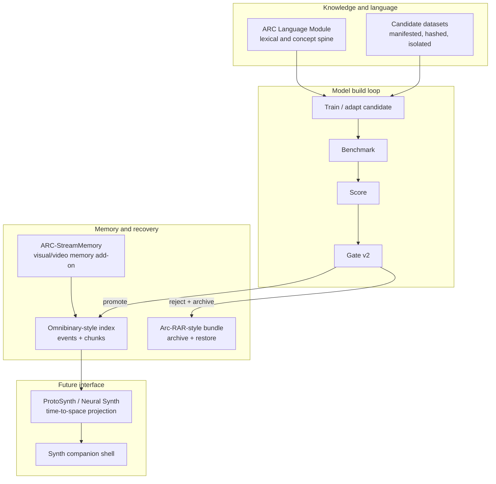

# ARC-Neuron LLMBuilder

**A governed local AI build-and-memory system for training, measuring, promoting, archiving, and restoring small language-model candidates with evidence instead of guesswork.**

> Local-first. CPU-friendly. Evidence-backed. Promotion-gated. Rollback-safe. Built as part of the ARC ecosystem.

> 🖥️ **Built and verified on a 2012 Intel Mac running macOS Catalina.** The original governed promotions, proof workflow, Omnibinary measurements, and audit loop were produced on old consumer hardware: no GPU, no cloud requirement, no accelerator. The point is not to claim frontier-scale intelligence from a tiny model; the point is to prove a reproducible model-growth loop that can run almost anywhere.

### Supporters

<a href="https://github.com/GareBear99/ARC-Neuron-LLMBuilder/stargazers">
  
</a>

<sub>**Topics**: local-ai · offline-llm · governed-ai · model-governance · gguf · provenance · rollback · omnibinary · arc-rar · arc-language-module · arc-streammemory · visual-memory · neural-synth · protosynth · agi-assistant</sub>

[](./LICENSE)
[](https://www.python.org/downloads/)
[](./tests)
[](./specs/promotion_gate_v2.yaml)
[](./MODEL_CARD_v10_wave4.md)
[](./CHANGELOG.md)
[](./STORAGE_ECONOMICS.md)
[](./PROOF.md#hardware-provenance)
[](https://github.com/sponsors/GareBear99)
[](https://github.com/GareBear99/ARC-Neuron-LLMBuilder/discussions)

---

## Fast path

```bash
git clone https://github.com/GareBear99/ARC-Neuron-LLMBuilder.git
cd ARC-Neuron-LLMBuilder
python3 -m venv .venv
source .venv/bin/activate
pip install -r requirements.txt
python scripts/validate_repo.py
python -m pytest tests/ -q
```

Run the proof loop:

```bash
python3 scripts/ops/demo_proof_workflow.py
python3 scripts/ops/benchmark_omnibinary.py
```

Run the incumbent benchmark path:

```bash
python3 scripts/execution/run_model_benchmarks.py \
  --adapter exemplar \
  --artifact exports/candidates/arc_governed_v10_wave4/exemplar_train/exemplar_model.json \
  --prompt-profile full_benchmark_v6 \
  --output results/v10_wave4_rerun_outputs.jsonl

python3 scripts/execution/score_benchmark_outputs.py \
  --input results/v10_wave4_rerun_outputs.jsonl \
  --output results/v10_wave4_rerun_scored.json
```

---

## Table of contents

- [What this is](#what-this-is)
- [Current truth](#current-truth)
- [Why clone it](#why-clone-it)
- [ARC ecosystem role](#arc-ecosystem-role)
- [Architecture](#architecture)
- [Governance doctrine](#governance-doctrine)
- [Dataset acquisition roadmap](#dataset-acquisition-roadmap)
- [ARC-StreamMemory add-on](#arc-streammemory-add-on)
- [Roadmap: 3.0 to 7.0](#roadmap-30-to-70)
- [Benchmark surface](#benchmark-surface)
- [Repository layout](#repository-layout)
- [One-command operations](#one-command-operations)
- [Proof runners](#proof-runners)
- [Documentation](#documentation)
- [Status and scope](#status-and-scope)
- [Citation](#citation)
- [License](#license)

---

## What this is

ARC-Neuron LLMBuilder is a local-first cognition lab that treats a model as one artifact inside a governed lifecycle.

A candidate does not become the incumbent because it looks better once. It has to be built, benchmarked, scored, compared, checked against protected floors, and archived with receipts. If it improves without breaking protected capabilities, it can be promoted. If it regresses, it stays a candidate and the previous model remains recoverable.

The repo currently proves the loop with small native models, exemplar adapters, benchmark runners, promotion gates, Omnibinary-style indexing, Arc-RAR-style bundle discipline, and human-readable reports.

This is not presented as a frontier model. It is presented as the control system around model growth: provenance, regression checks, promotion gates, rollback, and a path for adding stronger model backends without destroying the evidence chain.

---

## Current truth

| Area | Current status |
|---|---|
| Reproducible incumbent | `arc_governed_v10_wave4` |
| Incumbent score | `0.9237` |
| v11.3 / wave5 | Candidate/staging, not the public incumbent |
| Tests | 136/136 in the current production-candidate evidence path |
| External datasets | Roadmap/acquisition targets only; not promoted into incumbent weights |
| Live knowledge source | Self-curated ARC material plus ARC Language Module lexical/knowledge spine |
| Model weights | Tiny/Small proof-of-loop reference tiers, not the final brain |
| Governance | Gate v2, floor checks, score reports, candidate receipts, rollback discipline |
| Archive layer | Omnibinary-style event/index substrate + Arc-RAR-style restorable bundle layer |
| Add-on memory layer | ARC-StreamMemory as an external visual/video memory add-on for LLMs and ARC-style systems |

**Important correction:** future dataset additions do not overwrite the incumbent lane. New data enters a candidate class first, with manifest, license check, hash, quarantine/raw staging, evaluation, benchmark comparison, and no-regression promotion.

---

## Why clone it

Clone this repo if you care about any of the following:

- running a local AI/model-growth loop without requiring cloud infrastructure;
- measuring candidate models against a repeatable benchmark instead of vibes;
- preserving old models when new ones fail;
- keeping receipts for why a model was promoted or rejected;
- connecting small native models, GGUF-style backends, and external adapters under one governance layer;
- building toward ARC-style memory, archive, rollback, and cross-device communication;
- studying how a small CPU-friendly lab can enforce provenance before scaling model size.

The repo's value is the **governed growth loop**. Bigger models can be attached later; the point is that they should be measured and promoted through the same evidence path.

---

## ARC ecosystem role

ARC-Neuron LLMBuilder is the model-growth and promotion lab inside the ARC stack.

| Repo / layer | Role |
|---|---|
| [ARC-Core](https://github.com/GareBear99/ARC-Core) | authority, receipts, proposals, canonical events |
| [arc-lucifer-cleanroom-runtime](https://github.com/GareBear99/arc-lucifer-cleanroom-runtime) | deterministic runtime / execution shell |
| [arc-cognition-core](https://github.com/GareBear99/arc-cognition-core) | upstream cognition doctrine and evaluation concepts |
| [arc-language-module](https://github.com/GareBear99/arc-language-module) | current lexical and knowledge-weight carrier |
| [Omnibinary](./STORAGE_ECONOMICS.md) | binary/event/index memory substrate concept |
| [Arc-RAR](https://github.com/GareBear99/Arc-RAR) | archive, bundle, replay, restore discipline |
| [ARC-StreamMemory](https://github.com/GareBear99/ARC-StreamMemory) | visual/video memory add-on for LLMs and ARC-style systems |
| [Proto-Synth Grid Engine](https://github.com/GareBear99/Proto-Synth_Grid_Engine) | 4.0 visual cognition / spatial projection interface target |

---

## Architecture



The current system separates four concerns:

1. **Language and knowledge spine** — the ARC Language Module carries the live lexical/conceptual weight until external datasets are formally acquired and promoted.
2. **Model candidate loop** — candidates are trained/adapted, benchmarked, scored, compared, and either promoted or rejected.
3. **Archive and communication layer** — Omnibinary + Arc-RAR preserve event/index/bundle continuity so states can be replayed, moved, and restored across devices.
4. **Projection and companion layer** — ProtoSynth/Neural Synth and ARC-StreamMemory become the visual/spatial interface layer after the governed model base is stable.

---

## Governance doctrine

The core rule:

> ARC-Neuron should not merely become smarter. It should preserve how it became smarter.

A promotion requires:

- a named candidate;
- a benchmark output file;
- a scored report;
- comparison against incumbent floors;
- no protected capability breach;
- an archive/receipt path;
- a clear reason for promotion or rejection.

New weights, new datasets, and new adapters must not silently overwrite the incumbent lane. They must enter an isolated candidate class first.

---

## Dataset acquisition roadmap

No external third-party dataset listed here is claimed as currently ingested or promoted into the incumbent. These are acquisition/evaluation targets for the 3.0 roadmap. Each must pass license review, manifest creation, hashing, quarantine/raw staging, transformation logging, v2 candidate isolation, and no-regression benchmark proof.

| Dataset / source | Intended use | Current status |
|---|---|---|
| [FLAN Collection](https://github.com/google-research/FLAN) | broad instruction-following and task-format coverage | roadmap candidate |
| [OpenAssistant OASST1](https://huggingface.co/datasets/OpenAssistant/oasst1) | assistant dialogue and preference-style interaction examples | roadmap candidate |
| [UltraChat / UltraChat 200k](https://huggingface.co/datasets/HuggingFaceH4/ultrachat_200k) | multi-turn instruction/chat data | roadmap candidate |
| [MentalChat16K](https://huggingface.co/papers/2503.13509) | empathy, support-language, and lexical simplicity research lane only | roadmap candidate |
| [WikiLarge](https://huggingface.co/datasets/liweili/c4_200m/tree/main) / text simplification references | plain-language rewriting and lexical simplification | roadmap candidate |
| [GSM8K](https://huggingface.co/datasets/openai/gsm8k) | math reasoning evaluation/training references | roadmap candidate |
| [MBPP](https://huggingface.co/datasets/google-research-datasets/mbpp) | Python/code task generation and repair | roadmap candidate |
| [HumanEval](https://github.com/openai/human-eval) | code generation evaluation | roadmap candidate |
| [BigCode The Stack / The Stack v2](https://huggingface.co/bigcode) | code corpus reference with strict license review | roadmap candidate |
| ARC-native operator corrections | highest-trust self-curated corrections, review logs, and receipts | active/self-curated lane |
| Memory continuity tasks | repeated-question, provenance, and doctrine-retention tests | repo-owned evaluation lane |

Mental-health/counseling-style datasets are not used to turn this into a therapy system. They belong to a candidate-only support-language lane for clarity, de-escalation, empathy, and plain-English response quality.

---

## ARC-StreamMemory add-on

[ARC-StreamMemory](https://github.com/GareBear99/ARC-StreamMemory) is documented as an add-on being built for **all LLMs and ARC-style systems**, not as hidden current ARC-Neuron weights.

Its role is to turn visual input into AI-readable memory modules:

- screen recordings;
- screenshots;
- robotics camera feeds;
- DAW/plugin sessions;
- UI state footage;
- game/dev footage;
- visual RAG frame retrieval;
- deterministic frame hashes and source spines;
- digest JSON that can attach to model or ARC memory modules.

In the ARC-Neuron roadmap, StreamMemory supplies a visual memory input path. ARC-Neuron remains the governed model-growth loop; StreamMemory is the visual/video memory layer that can feed future candidates through receipts and manifests.

---

## Roadmap: 3.0 to 7.0

| Version horizon | Focus | Boundary |
|---|---|---|
| **3.0** | protected base-model roadmap integration, dataset governance, candidate isolation, licensing transition | model/data/legal foundation |
| **4.0** | ProtoSynth / Neural Synth spatial projection layer | visual cognition and time-to-space projection |
| **5.0** | full Portal-esque Synth companion mockup | companion shell prototype and interaction model |
| **7.0** | working Synth AI companion, AGI assistant, and buildable brain lab | integrated assistant + lab interface |

This roadmap is intentionally staged. 3.0 must protect the model/data/provenance base before 4.0+ turns it into a spatial interface and companion system.

---

## Benchmark surface

The current production-candidate path tracks 17 benchmark files / 168 total tasks across ARC reasoning, planning, reflection, continuity, instruction following, state evidence, native operation planning, runtime reasoning, refusal correctness, lexical accuracy, and memory/continuity regression.

The current public incumbent remains `arc_governed_v10_wave4` at `0.9237`. v11.3/wave5 is kept as candidate/staging until its promotion evidence is reproducible against Gate v2.

---

## Repository layout

```text
ARC-Neuron-LLMBuilder/
├── arc_core/              # core model/runtime utilities
├── arc_tiny/              # Tiny reference tier
├── arc_neuron_small/      # Small reference tier
├── arc_neuron_tokenizer/  # tokenizer tools
├── adapters/              # exemplar, command, llama.cpp HTTP, OpenAI-style boundaries
├── runtime/               # canonical pipeline, reflection, absorption, terminology, floor model
├── scorers/               # task-aware rubric scoring
├── scripts/               # training, execution, ops, proof runners, lab helpers
├── benchmarks/            # governed benchmark tasks
├── datasets/              # self-curated seed and SFT material
├── specs/                 # Gate v2, schemas, promotion doctrine
├── configs/               # candidate and runtime configs
├── reports/               # audit and promotion evidence
├── artifacts/             # bundles, ledgers, model artifacts
├── exports/candidates/    # candidate artifacts
├── results/               # benchmark outputs, scored summaries, scoreboard
├── tests/                 # validation and regression tests
└── docs/                  # design, proof, roadmap, and operator docs
```

---

## One-command operations

```bash
make validate          # validate repo structure and required files
make test              # run the test suite
make counts            # count datasets and benchmarks
make candidate-gate    # run candidate gate
make native-tiny       # train ARC-Tiny reference candidate
make native-small      # train ARC-Small reference candidate
make full-loop         # train → benchmark → score → gate → bundle → verify
make pipeline          # run one conversation through the canonical path
make verify-store      # verify Omnibinary ledger integrity
```

---

## Proof runners

```bash
# End-to-end proof: term → conversation → train → benchmark → gate → archive
python3 scripts/ops/demo_proof_workflow.py

# Measure Omnibinary throughput, latency, and fidelity
python3 scripts/ops/benchmark_omnibinary.py

# Run governed promotion cycles and emit a repeatability verdict
python3 scripts/ops/run_n_cycles.py --cycles 3 --tier small --steps 300

# Generate draft→critique→revise SFT pairs from the incumbent
python3 scripts/ops/generate_reflection_sft.py

# Absorb a conversation session end-to-end into the learning pipeline
python3 scripts/ops/absorb_session.py --text "..." --session-id my_session
```

---

## Documentation

### Core

- [ARCHITECTURE.md](./ARCHITECTURE.md) — system map and frozen roles
- [GOVERNANCE_DOCTRINE.md](./GOVERNANCE_DOCTRINE.md) — Gate v2, floor model, archive doctrine
- [ECOSYSTEM.md](./ECOSYSTEM.md) — ARC repo roles and integration boundaries
- [QUICKSTART.md](./QUICKSTART.md) — quick usage path
- [PROOF.md](./PROOF.md) — claim → receipt → verification command
- [MODEL_CARD_v10_wave4.md](./MODEL_CARD_v10_wave4.md) — current reproducible incumbent
- [docs/BENCHMARK_PROOF.md](./docs/BENCHMARK_PROOF.md) — audit proof and reproducible benchmark commands

### Roadmap additions

- [docs/DATASET_ACQUISITION_MATRIX_3_0.md](./docs/DATASET_ACQUISITION_MATRIX_3_0.md) — exact dataset acquisition roadmap and status boundaries
- [docs/V2_CANDIDATE_ISOLATION_POLICY.md](./docs/V2_CANDIDATE_ISOLATION_POLICY.md) — why new weights/datasets do not overwrite incumbent scoring
- [docs/ARC_STREAMMEMORY_ADDON.md](./docs/ARC_STREAMMEMORY_ADDON.md) — visual/video memory add-on role
- [docs/SYNTH_COMPANION_ROADMAP_4_5_7.md](./docs/SYNTH_COMPANION_ROADMAP_4_5_7.md) — 4.0/5.0/7.0 Synth roadmap
- [llms.txt](./llms.txt) — short bot-readable project summary

### Community

- [CONTRIBUTING.md](./CONTRIBUTING.md) — contribution guide
- [CODE_OF_CONDUCT.md](./CODE_OF_CONDUCT.md) — community standard
- [SECURITY.md](./SECURITY.md) — security/disclosure path
- [GitHub Discussions](https://github.com/GareBear99/ARC-Neuron-LLMBuilder/discussions) — questions and roadmap discussion
- [GitHub Issues](https://github.com/GareBear99/ARC-Neuron-LLMBuilder/issues) — bugs, benchmark issues, feature requests
- [GitHub Sponsors](https://github.com/sponsors/GareBear99) — support the ARC ecosystem

---

## Status and scope

**What this is:** a local-first governed cognition lab and control plane for training, promoting, rejecting, archiving, and restoring language-model candidates with full lineage.

**What this is not:** a claim that the included Tiny/Small reference models are frontier LLMs. The included native models are intentionally small proof-of-loop tiers. The contribution is the governed lifecycle: measurement, promotion, rollback, manifests, and reproducible evidence.

**The shell is the product foundation. The brain is the research lane.** Stronger models, GGUF adapters, language modules, external datasets, and visual memory systems can plug into the same governed path once they are isolated and measured.

---

## GitHub About description

Recommended repository description:

```text
Governed local AI / offline LLM builder for reproducible model growth, Gate v2 promotion, dataset provenance, Omnibinary memory, Arc-RAR rollback, ARC Language Module truth-weighting, ARC-StreamMemory visual memory, and the 3.0→7.0 Synth companion roadmap.
```

Recommended topics are in [repo-metadata/GITHUB_ABOUT_UPDATE.md](./repo-metadata/GITHUB_ABOUT_UPDATE.md).

---

## Citation

```bibtex
@software{arc_neuron_llmbuilder_2026,
  author  = {Doman, Gary},
  title   = {ARC-Neuron LLMBuilder: A Governed Local AI Build-and-Memory System},
  year    = 2026,
  url     = {https://github.com/GareBear99/ARC-Neuron-LLMBuilder}
}
```

---

## License

MIT for currently released source unless superseded by a future release file. The 3.0 roadmap includes a licensing transition for protected model/data releases; existing historical releases keep their original license terms.

---

## One-line verdict

**ARC-Neuron LLMBuilder is a local-first model-growth lab that keeps the evidence chain intact: train candidates, measure them, promote only when the gate allows it, and preserve the path that made the system smarter.**
