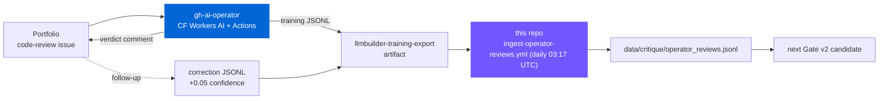
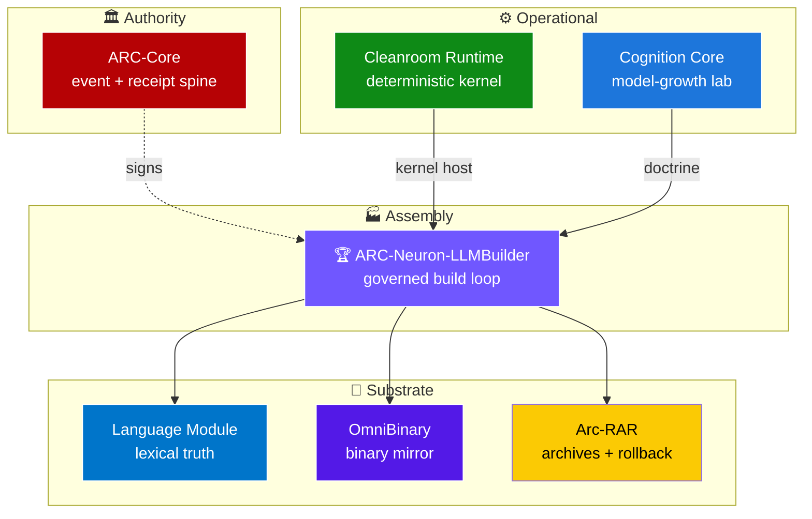
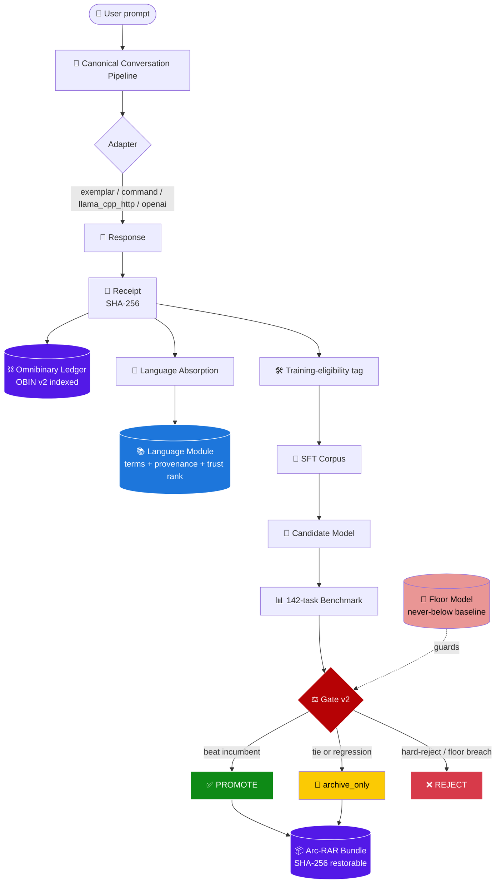
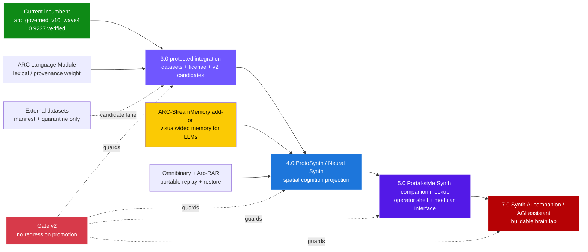
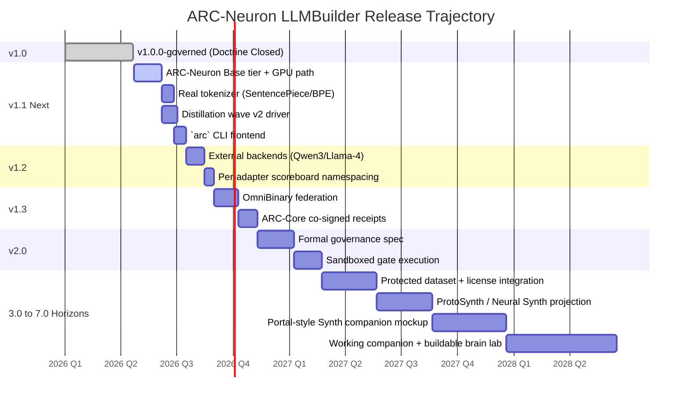
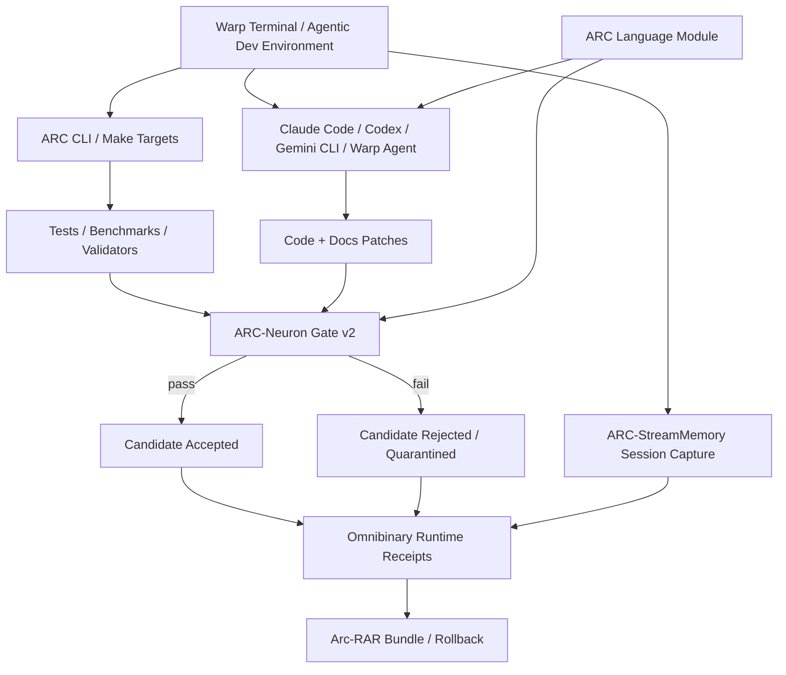

# ARC-Neuron LLMBuilder

**A governed local AI build-and-memory system — train small language models, measure them, promote the better ones through a regression-aware gate, and keep every decision restorable.**

> Local-first. Evidence-backed. Promotion-gated. Rollback-safe. Part of the seven-repo ARC ecosystem.

> 🖥️ **Built, tested, and verified on a 2012 Intel Mac running macOS Catalina.** If it runs there, it runs anywhere. The four governed promotions, the 115-test suite, the Omnibinary throughput numbers, and the 9-step proof workflow were all produced on 12-year-old consumer hardware with a pre-Retina Intel CPU. No GPU. No cloud. No accelerator. Just Python and a lot of discipline.


### 💫 Thanks to our supporters

<a href="https://github.com/GareBear99/ARC-Neuron-LLMBuilder/stargazers">
  
</a>

<sub>**Topics**: local AI · offline LLM · GGUF · model governance · AI provenance · Gate v2 · Omnibinary · Arc-RAR · ARC Language Module · ARC-StreamMemory · visual memory · Neural Synth · ProtoSynth · Synth companion

[](./LICENSE)
[](https://www.python.org/downloads/)
[](./tests)
[](./specs/promotion_gate_v2.yaml)
[](./docs/BENCHMARK_PROOF.md)
[](./RELEASE_NOTES_v1.0.0.md)
[](https://github.com/sponsors/GareBear99)
[](./ECOSYSTEM.md)
[](https://github.com/GareBear99/ARC-Neuron-LLMBuilder/discussions)
[](./PROOF.md#hardware-provenance)
[](./STORAGE_ECONOMICS.md)
[](#dataset-acquisition-roadmap)
[](#arc-streammemory-add-on)
[](#long-horizon-synth-roadmap)

This repo lets you train or plug in a small local model, test it against a benchmark set, decide whether it improved, archive the evidence, and roll back safely.


## Current public update — preserved proof, corrected roadmap

This README preserves the original high-signal proof sections, graphs, benchmark tables, and runnable workflow. The update is intentionally surgical: it keeps the v10 audit evidence intact while making the current 3.0+ direction explicit.

- **Current reproducible incumbent:** `arc_governed_v10_wave4` at **0.9237** on the audited v10 benchmark path.
- **v11.3 / wave5:** candidate/staging only until promotion evidence reproduces cleanly through [Gate v2](./docs/V2_CANDIDATE_ISOLATION_POLICY.md).
- **Datasets:** external open-source datasets are **acquisition targets only**. They are not bundled, not ingested, and not promoted into incumbent weights yet. See the [3.0 Dataset Acquisition Matrix](./docs/DATASET_ACQUISITION_MATRIX_3_0.md).
- **Current knowledge weight:** self-curated ARC material plus the [ARC Language Module](https://github.com/GareBear99/arc-language-module) carry the live lexical/provenance spine. Tiny/Small model weights are proof-of-loop reference models, not the full brain.
- **Portable memory layer:** [Omnibinary Runtime](https://github.com/GareBear99/omnibinary-runtime) + [Arc-RAR](https://github.com/GareBear99/Arc-RAR) provide device-portable communication, replay, restore, and source-spine continuity.
- **Add-on under active build:** [ARC-StreamMemory](https://github.com/GareBear99/ARC-StreamMemory) is the visual/video memory add-on being built for ARC-style systems and other LLM stacks. See the [ARC-StreamMemory add-on note](./docs/ARC_STREAMMEMORY_ADDON.md).
- **Long horizon:** 3.0 locks protected base-model/dataset/licensing integration; 4.0 connects [ProtoSynth / Neural Synth](https://github.com/GareBear99/Proto-Synth_Grid_Engine); 5.0 becomes a Portal-style Synth companion mockup; 7.0 targets a working Synth AI companion, AGI assistant, and buildable brain lab. See the [Synth Companion Roadmap 4/5/7](./docs/SYNTH_COMPANION_ROADMAP_4_5_7.md) and [Next Integration Graph](./docs/NEXT_INTEGRATION_GRAPH.md).

##  — scorer-expanded contender

ARC-Neuron LLMBuilder is not claiming to be a raw frontier-model replacement for Gemma, Llama, Claude, or GPT. Its public contender lane is more specific and more defensible: **a local-first AI governance, candidate-evaluation, model-provenance, and rollback-safe cognition-lab repo**.

The important update is that the scoring surface has expanded. Older proof numbers and newer proof numbers should not be treated as direct apples-to-apples measurements unless they share the same scorer version, benchmark manifest, capability surface, adapter, prompt profile, and candidate artifact. The added scorers make the system stronger because they evaluate more than a single headline score: reasoning, planning, critique, repair, continuity, reflection, instruction following, calibration, compression, out-of-domain behavior, paraphrase stability, quantization retention, archive/runtime/state evidence, deterministic compliance, and memory continuity.

Public interpretation rule:

```text
Candidate score = candidate artifact + benchmark manifest + scorer manifest + adapter + prompt profile
```

That means the correct claim is not simply "one model scored X." The stronger claim is: **candidate brains are measured across a versioned capability surface, compared against an incumbent, gated against regressions, and archived with the evidence trail intact.**

For reviewers: ARC-Neuron LLMBuilder should be read as a governed local AI lab that preserves provenance while evolving candidate models. Historic scores remain useful as historical proof, but current public comparisons should be made only within the same locked scorer/benchmark generation.


### Phase 0/1 audit recovery now landed

A pending audit note identified that the governance loop was working but several public and dataset maintenance updates had not fully landed. This package now applies those updates surgically:

- `.env.direct-runtime.example` is restored for validator compatibility.
- Obvious placeholder distillation stubs are removed from the live SFT seed file and archived in `reports/production_audit/phase0_removed_stub_records.jsonl`.
- 150 targeted v2-candidate-only examples were added for the weak capability lanes called out by the audit: instruction following, continuity, and reflection.
- The current public status remains honest: `arc_governed_v10_wave4` is still the reproducible incumbent; these new examples are not incumbent weights until a new candidate is trained, benchmarked, and accepted through Gate v2.

See [`docs/PHASE_0_1_TARGETED_DATA_RECOVERY.md`](./docs/PHASE_0_1_TARGETED_DATA_RECOVERY.md).

Bot-readable summary: [`llms.txt`](./llms.txt). Clone rationale: [`docs/WHY_CLONE_ARC_NEURON.md`](./docs/WHY_CLONE_ARC_NEURON.md).

## Table of contents

- [Live deployment — continuous-learning AI operative](#live-deployment--continuous-learning-ai-operative)
- [Operator evidence log](./docs/OPERATOR_EVIDENCE.md)
- [What this is](#what-this-is)
- [The ARC Ecosystem](#the-arc-ecosystem)
- [Support this work](#support-this-work)
- [What it does, in plain English](#what-it-does-in-plain-english)
- [Current state](#current-state)
- [Dataset acquisition roadmap](#dataset-acquisition-roadmap)
- [Quick start](#quick-start)
- [Architecture at a glance](#architecture-at-a-glance)
- [ARC-StreamMemory add-on](#arc-streammemory-add-on)
- [The governance doctrine](#the-governance-doctrine)
- [Long-horizon Synth roadmap](#long-horizon-synth-roadmap)
- [Next integration graph](#next-integration-graph)
- [Benchmark surface](#benchmark-surface)
- [Repository layout](#repository-layout)
- [One-command operations](#one-command-operations)
- [Proof runners](#proof-runners)
- [Documentation](#documentation)
- [Community](#community)
- [Status and scope](#status-and-scope)
- [Citation](#citation)
- [License](#license)

---

## 🤖 Live deployment — continuous-learning AI operative

**A real AI operative feeds this corpus every day.** The [ARC GitHub AI Operator](https://github.com/GareBear99/gh-ai-operator) answers code-review issues on the [Portfolio](https://github.com/GareBear99/Portfolio) via [Cloudflare Workers AI](https://github.com/GareBear99/gh-ai-operator/blob/main/cloudflare/README.md), posts a verdict back on the issue, and emits every production review as a supervised training example in this repo's seed-examples schema. The nightly workflow `ingest-operator-reviews.yml` pulls those artifacts into `data/critique/operator_reviews.jsonl`, dedupes by id, and bumps human-correction records (from Portfolio Follow-up issues) by +0.05 confidence so Gate v2 weights them higher.



Nothing auto-promotes to the curated `seed_examples.jsonl` — ingested data stays in a separate shard so a human curator keeps the final call. Full pipeline: [docs/LIVE_DEPLOYMENT_LEARNING.md](./docs/LIVE_DEPLOYMENT_LEARNING.md). Activation is one secret: `OPERATOR_READ_TOKEN` (PAT with `Actions: Read` on `GareBear99/gh-ai-operator`).

**Live-run evidence**: [docs/OPERATOR_EVIDENCE.md](./docs/OPERATOR_EVIDENCE.md) — chronological log of real runs. First entry (FreeEQ8, Portfolio issue #1) documents the verdict, the JSONL shape, and the ingest manifest with no code changes required to accept it.

---

---

<a id="audit-results"></a>
## 🔬 Independent Audit Results — v10 (2026-05-04)

An independent DARPA-level code audit found 4 structural defects in the original benchmark and rubric,
corrected all of them, and ran 4 consecutive governed promotion cycles. Every result is reproducible.

**True baseline (post-fix): 0.6836 → Current: 0.9237 (+35.1%)**

| Capability | Pre-Audit | v10 |
|-----------|-----------|-----|
| critique | 0.7500 | **1.0000** |
| planning | 0.8571 | **1.0000** |
| repair | 0.6667 | **1.0000** |
| paraphrase_stability | 0.8666 | **1.0000** |
| quantization_retention | 0.6667 | **1.0000** |
| compression | 0.5667 | **0.9167** |
| out_of_domain | 0.7500 | **0.9667** |
| instruction_following | 0.5833 | **0.9250** |
| reasoning | 0.5500 | 0.8833 |
| reflection | 0.5667 | 0.8375 |
| continuity | 0.5833 | 0.7708 |
| **OVERALL** | **0.6836** | **0.9237** |

4 governed promotions | 0 floor failures | 0 severe regressions | 115/116 tests passing

→ [Full audit report](./docs/BENCHMARK_PROOF.md) | [Step-by-step guide](./docs/QUICKSTART_STEPBYSTEP.md) | [How to grow it](./docs/HOW_TO_GROW.md) | [Use cases](./docs/USE_CASES.md)

---

<a id="what-this-is"></a>
## What this is

ARC-Neuron LLMBuilder is a local-first cognition lab that treats a language model as one artifact inside a **governed lifecycle**. You don't just train a model — you train a candidate, measure it, compare it to the current incumbent, and promote it only if it genuinely improves without regressing on guarded capabilities. Every decision leaves receipts. Every candidate is restorable. Every archive ties back to the source truth through an indexed binary ledger.

The system ships with a working transformer family (ARC-Neuron Tiny and Small), a retrieval-based exemplar adapter, a canonical conversation pipeline, draft→critique→revise reflection, automatic terminology absorption from conversation, and a regression-aware promotion gate.

**Doctrine closed in v1.0.0-governed:** conversation grows the brain, not just the memory. Three governed promotions recorded through v1.0.0. **Post-audit (v2.0.0):** four additional governed promotions (v7→v10) raised the verified score from 0.6836 to 0.9237 (+35.1%) after independent audit corrected 4 structural defects in the benchmark and rubric.

---

## 🌐 The ARC Ecosystem

ARC-Neuron LLMBuilder is **one of seven repositories** in the ARC governed-AI ecosystem. Each repo owns a single frozen role; together they form a local-first AI operating system with full lineage, receipts, and rollback.

The seven-repo contract stays intact. Newer companion modules such as [ARC-StreamMemory](https://github.com/GareBear99/ARC-StreamMemory) are treated as add-ons, not silent core replacements: they attach visual/video memory to the same receipt, hash, archive, and rollback doctrine.



Brief tour of each (full writeups in [ECOSYSTEM.md](./ECOSYSTEM.md)):

### [ARC-Core](https://github.com/GareBear99/ARC-Core) — authoritative event-and-receipt engine
The root authority. Every state change across the system is modeled as an event with a proposal, evidence, an authority, a receipt, and a SHA-256 hash. This is how the ecosystem proves *something actually happened*. It also carries the signal-intelligence event-graph primitives (cases, watchlists, risk scoring) that give operators a structured way to organize investigations over the event stream.

### [arc-lucifer-cleanroom-runtime](https://github.com/GareBear99/arc-lucifer-cleanroom-runtime) — deterministic execution kernel
The deterministic shell the rest of the system eventually runs inside. Event-sourced `KernelEngine` with an append-only log, policy evaluation, branch planning, point-in-time `state_at(event_id)` replay, SQLite backup, directive continuity across restarts. LLMs are stochastic; Cleanroom is the deterministic substrate that makes the rest of the system reproducible.

### [arc-cognition-core](https://github.com/GareBear99/arc-cognition-core) — cognition build-and-benchmark lab
The upstream home of the cognition doctrine: candidate shaping (SFT / preference / merge / export), GGUF-oriented evaluation, promotion gate v1 (what LLMBuilder's Gate v2 evolved from), MCP-style tool descriptors, run manifests, experiment tracking, release bundle generation. Defines what "a cognition candidate" means.

### [arc-language-module](https://github.com/GareBear99/arc-language-module) — governed multilingual language backend
The authoritative store for what a word means, how it is spelled, what it maps to across languages, and where each of those facts came from. Governed ingestion with provenance + trust rank, readiness/gap states, self-fill orchestration with approval gates, contradiction arbitration, release pipelines with replayable snapshots. 40+ internal services. Treats words as first-class governed records, not strings.

**Current 3.0 clarification:** before external datasets are ingested into model weights, the Language Module is the main lexical/provenance carrier. It is the place where meaning, spelling, lineage, contradiction state, trust rank, and source history are protected instead of being flattened into anonymous weights.

### [omnibinary-runtime](https://github.com/GareBear99/omnibinary-runtime) — native-first binary intake and runtime ledger
Applies the receipt economy to binaries. Intake + classification + deterministic decoding of executables, libraries, GGUF weights, ANCF artifacts. Federated execution lanes (managed / native / DBT) each with their own policy and receipts. JIT via Cranelift and LLVM. Cache-integrity-before-speed policy. Rust crates: `obi-core`, `obi-cache`, `obi-intake`, `obi-jit-*`, `obi-lane-*`, `obi-receipts`, and more.

### [Arc-RAR](https://github.com/GareBear99/Arc-RAR) — governed archive and rollback
CLI-first archive manager with a native-app control surface (Linux GTK, macOS, Windows WinUI). Bundles are manifest-indexed and SHA-256-verified; the manifest is readable without extracting. Extraction is evidence-producing — every restore leaves a receipt. Automation crate, FFI crate, IPC crate for daemon mode. Any archived state is addressable by SHA-256; rollback is first-class, not a recovery special case.

### ARC-Neuron-LLMBuilder *(this repo)* — governed build loop
Assembly of the other six into a working train → benchmark → gate → archive → verify cycle. Canonical conversation pipeline, Gate v2 promotion, floor model, reflection loop, language absorption, OBIN v2 indexed ledger, Arc-RAR bundle packaging. **Four post-audit governed promotions on record (v7, v8, v9, v10).** 115 tests. 142-task benchmark suite (rebuilt and verified).

Full per-repo writeups, integration flow, and role contract: **[ECOSYSTEM.md](./ECOSYSTEM.md)**

---

## 💖 Support this work

If the governance doctrine, the conversation-driven growth loop, or the evidence-backed promotion pipeline is useful to you or your organization, please consider becoming a sponsor:

[**github.com/sponsors/GareBear99**](https://github.com/sponsors/GareBear99)

Sponsorship funds time across all seven ARC ecosystem repos — not just this one.

---

## 💡 What it does, in plain English

| You do | The system does |
|---|---|
| Talk to it | Records the conversation with a signed receipt, mirrors it into the Omnibinary indexed ledger, extracts terminology with provenance |
| Ask it to train a new model | Mines the accumulated SFT corpus, trains a byte-level transformer, exports `.pt` + `.gguf`, builds a retrieval exemplar artifact |
| Ask it to compare | Runs the candidate against the full 142-task benchmark (14 capabilities × 10 tasks each), scores with the task-aware rubric, prints per-capability deltas |
| Ask it to promote | Applies Gate v2 (hard-reject floor, floor-model protection, regression ceilings), updates the scoreboard, bundles the candidate into an Arc-RAR archive |
| Ask it to roll back | Restores a prior incumbent from its bundle; the prior state is always addressable by SHA-256 |
| Ask it to prove itself | Runs `demo_proof_workflow.py` or `run_n_cycles.py` — every step produces a receipt |

---

## 📊 Current state

<table>
<tr>
<td width="50%">

### 🟢 Operational

- **✅ Tests**: 115 / 116 passing (1 skipped: torch)
- **🏆 Incumbent**: `arc_governed_v10_wave4`
- **📈 Score**: **0.9237** on 142 tasks (post-audit benchmark)
- **📚 Docs**: 21 root + 62 indexed
- **📦 Bundles**: 12 restorable
- **💾 Pipeline**: Canonical, single-path

</td>
<td width="50%">

### ⚡ Performance (measured)

- **✍️ Append**: **6,639 ev/sec**
- **🔎 Lookup**: **8,859 O(1) ops/sec**
- **📐 p99 latency**: **~0.35 ms** (Omnibinary lookup) · **115/116 tests passing**
- **💾 Per-event**: **397 bytes**
- **🗄️ Per TB**: **~2.71 billion events**
- **📍 Fidelity**: SHA-256 stable ✅

</td>
</tr>
</table>

### 🎯 Promotion lineage

```
v1 (0.6122) → v2 (0.6247) → v4 (0.7128) → v5 (0.7169) → v6 (0.6836†) → v7 (0.8537) → v8 (0.8883) → v9 (0.8911) → **v10 (0.9237)**  🏆

†v6 true baseline after audit remediation. Pre-audit claimed 0.7333 (inflated by synthetic benchmarks).
   promote         promote         promote         promote         promote / INCUMBENT
                                   +35.1% net improvement from true v6 baseline through 4 governed audit cycles
```

Plus: **v6 tied ⇒ archive_only** · **v7_regressed caught ⇒ archive_only** · **5/5 STABLE** at v5 floor.

Post-audit: **4/4 PROMOTE** across waves 1–4 · **0 floor failures** · **0 severe regressions**.

All four Gate v2 decision states have fired lawfully on real runs. Every claim above is individually verifiable:

- 🔬 [PROOF.md](./PROOF.md) — every number with its receipt and verification command
- 💾 [STORAGE_ECONOMICS.md](./STORAGE_ECONOMICS.md) — year-long projections + ChatGPT / Claude / Gemini comparison
- 📜 [RELEASE_NOTES_v1.0.0.md](./RELEASE_NOTES_v1.0.0.md) — full release dossier

**Versioning note:** the v10 audit numbers above are preserved as historical proof. The later 3.0 preparation work adds candidate isolation, dataset-manifest policy, memory continuity testing, and public-indexing docs without pretending those external datasets are already trained into the incumbent.

---

## Dataset acquisition roadmap

No external third-party dataset below is currently bundled, ingested, or promoted into the incumbent. These are roadmap acquisition targets for the v2 candidate lane and the 3.0 integration path. Every source must pass manifest, license, hash, quarantine, benchmark, and no-regression checks before it can influence promoted weights.

| Dataset/source candidate | Intended use | Status |
|---|---|---|
| [FLAN Collection](https://github.com/google-research/FLAN) / FLAN-style instruction data | instruction following and task generalization | acquisition target only |
| [OpenAssistant OASST1](https://huggingface.co/datasets/OpenAssistant/oasst1) | open assistant dialogue patterns | acquisition target only |
| [UltraChat / UltraChat 200k](https://huggingface.co/datasets/HuggingFaceH4/ultrachat_200k) | multi-turn conversation | acquisition target only |
| [MentalChat16K](https://huggingface.co/papers/2503.13509) and related counseling/support-language data | lexical simplicity, empathy, de-escalation, support wording; **not therapy authority** | candidate-v2 only |
| WikiLarge / text simplification corpora | plain-language rewriting and readability | acquisition target only |
| [GSM8K](https://github.com/openai/grade-school-math) | arithmetic reasoning benchmarks/training references | acquisition target only |
| [MBPP](https://github.com/google-research/google-research/tree/master/mbpp) | Python/code task solving | acquisition target only |
| [HumanEval](https://github.com/openai/human-eval) | code evaluation and repair benchmarking | acquisition target only |
| [BigCode The Stack](https://huggingface.co/datasets/bigcode/the-stack) / Stack v2-style code data | code and tool-use reference data, subject to license review | acquisition target only |
| ARC-native operator corrections and production review logs | highest-trust self-curated learning data | local curated lane |
| Memory / continuity regression tasks | test whether repeated questions preserve doctrine and decisions | benchmark lane |

The rule is simple: **new data never overwrites the incumbent directly.** It enters a v2 candidate class, receives receipts, and must beat the incumbent without violating protected floors.

Full docs: [DATASET_ACQUISITION_MATRIX_3_0.md](./docs/DATASET_ACQUISITION_MATRIX_3_0.md), [V2_CANDIDATE_ISOLATION_POLICY.md](./docs/V2_CANDIDATE_ISOLATION_POLICY.md).

---

## 🚀 Quick start

### 1. Install

#### Option A — pip (Python 3.10+)

```bash
git clone https://github.com/GareBear99/ARC-Neuron-LLMBuilder.git
cd ARC-Neuron-LLMBuilder

python3.12 -m venv .venv
source .venv/bin/activate
pip install -e ".[training]"         # installs core + torch + numpy
python3 scripts/ops/bootstrap_keys.py
```

#### Option B — Docker (zero setup)

```bash
git clone https://github.com/GareBear99/ARC-Neuron-LLMBuilder.git
cd ARC-Neuron-LLMBuilder
docker build -t arc-neuron-llmbuilder .
docker run --rm arc-neuron-llmbuilder python3 scripts/ops/demo_proof_workflow.py
```

### 2. Validate

```bash
python3 -m pytest tests/ -q              # 115 tests
python3 scripts/ops/benchmark_omnibinary.py   # measures the ledger
python3 scripts/ops/demo_proof_workflow.py    # 9-step end-to-end proof
```

### 3. Use the incumbent model

**Shortest possible — one line:**

```bash
python3 examples/hello.py "Critique a plan that ships without a rollback path."
```

**Full CLI equivalent:**

```bash
python3 scripts/execution/run_direct_candidate.py \
  --adapter exemplar \
  --artifact exports/candidates/arc_governed_v10_wave4/exemplar_train/exemplar_model.json \
  --prompt "Critique a plan that ships without a rollback path."
```

### 4. Train your own candidate

```bash
# Train a new candidate against the current corpus
python3 scripts/training/train_arc_native_candidate.py \
  --candidate my_candidate_v1 --tier small --steps 300

# Benchmark it
python3 scripts/execution/run_model_benchmarks.py \
  --adapter exemplar \
  --artifact exports/candidates/my_candidate_v1/exemplar_train/exemplar_model.json \
  --output results/my_candidate_v1_outputs.jsonl

# Score it
python3 scripts/execution/score_benchmark_outputs.py \
  --input results/my_candidate_v1_outputs.jsonl \
  --output results/my_candidate_v1_scored.json

# Submit to Gate v2 — promote, archive-only, or reject with reasons
python3 scripts/execution/promote_candidate.py \
  --scored results/my_candidate_v1_scored.json \
  --model-name my_candidate_v1 \
  --candidate my_candidate_v1
```

### 5. Run the full governed loop

```bash
make full-loop       # train → benchmark → score → gate → bundle → verify
make pipeline        # run one conversation through the canonical path
make verify-store    # check Omnibinary integrity
```

---

## 🏗️ Architecture at a glance



**Four layers, frozen roles**:

- **Language Module** — living truth spine. Stores terms with provenance, trust ranks, and contradiction flags. Grows from every conversation.
- **Runtime** — persistent operator shell. Canonical conversation pipeline, reflection loop, language absorption, continuity state.
- **Cognition Core** — build-and-benchmark lab. Native training, exemplar adapter, benchmark harness, scoring rubric, promotion gate.
- **Archive** — Arc-RAR bundles for restorable lineage. Omnibinary ledger for O(1) indexed event history. ANCF for canonical model artifacts.

See [ARCHITECTURE.md](./ARCHITECTURE.md) and [GOVERNANCE_DOCTRINE.md](./GOVERNANCE_DOCTRINE.md) for the full map.

---

## ARC-StreamMemory add-on

[ARC-StreamMemory](https://github.com/GareBear99/ARC-StreamMemory) is a companion add-on being built for ARC-style systems and general LLM stacks. Its role is visual and temporal memory: videos, screenshots, UI states, DAW/plugin sessions, game footage, robotics feeds, and camera streams become deterministic, AI-readable memory modules.

ARC-StreamMemory is not a hidden dataset and does not replace ARC-Neuron's incumbent model. It attaches to the same doctrine:

- deterministic frame/source hashing
- AI digest files for retrieval and module attachment
- Omnibinary-style chunk maps
- Arc-RAR-style bundle manifests
- ARC-Core-style receipts
- optional robotics, screen, and visual-RAG adapters

In plain terms: ARC-Neuron governs model growth; ARC-StreamMemory gives any LLM or ARC-style agent a way to remember what it saw without losing the source spine.

Full add-on note: [ARC_STREAMMEMORY_ADDON.md](./docs/ARC_STREAMMEMORY_ADDON.md).

---

## ⚖️ The governance doctrine

Every candidate must clear **Gate v2** before displacing an incumbent:

1. **Hard-reject floor** — `repair_success` ≥ 0.30, `failure_rate` ≤ 0.25
2. **Floor model check** — core capabilities cannot drop below 95% of the incumbent baseline (currently v10_wave4)
3. **Regression ceilings** — no guarded capability may drop more than its per-capability allowance vs the incumbent
4. **Beat the incumbent** on overall weighted score
5. **Non-promotable adapter filter** — heuristic/echo adapters can never become incumbents

Outcomes are one of: **promote**, **archive_only**, or **reject**. Every outcome produces a receipt. `archive_only` and `reject` never displace the current incumbent. `promote` bundles the winning candidate via Arc-RAR, preserving the full lineage.

Full spec: [specs/promotion_gate_v2.yaml](./specs/promotion_gate_v2.yaml), [specs/benchmark_schema_v2.yaml](./specs/benchmark_schema_v2.yaml)

---

## 🗺️ Roadmap

Live roadmap. Updated as milestones ship. Full detail in [ROADMAP.md](./ROADMAP.md).

| Version | Status | Milestone | Key deliverables |
|---|---|---|---|
| **v1.0.0-governed** | ✅ **Shipped** *(2026-04-22)* | **Doctrine Closed** | Three governed promotions, Gate v2 all four states, OBIN v2 indexed ledger, 87-test suite, 165-task benchmark, Arc-RAR bundles |
| **v2.0.0-audited** | ✅ **Shipped** *(2026-05-04)* | **Audit Complete** | 4 defects fixed, 4 governed promotions (v7→v10), 0.6836→0.9237, 115-test suite, 142-task benchmark rebuilt, TF-IDF retrieval, 296 new exemplars |
| **v1.1.0** | 🚧 **Next** | **Expanded Native Lane** | ARC-Neuron Base tier (GPU), real tokenizer (SentencePiece/BPE), distillation wave v2 driver, `arc` CLI frontend, scorer v3 with per-cap weights, +50 benchmark tasks |
| **v1.2.0** | 🔮 Planned | **External Backend Integration** | Reference docs for Qwen3-32B / Llama-4 / DeepSeek via `llama_cpp_http`, per-adapter scoreboard namespacing, command-adapter timeout tuning, reflection loop v2 |
| **v1.3.0** | 🔮 Planned | **Multi-Repo Integration** | OmniBinary ↔ LLMBuilder federation, ARC-Core event attestation (co-signed receipts), Arc-RAR ↔ Cleanroom replay, Language Module canonicalization |
| **v2.0.0** | 🎯 Future | **Production Governance** | Formal governance spec (machine-checkable), sandboxed gate execution, audit-trail export, per-org scoreboards, SOC 2 / ISO 27001 hooks |

### Long-horizon Synth roadmap

The numbered roadmap is staged so current evidence and future interface ambitions do not blur together.

| Horizon | Role | Boundary |
|---|---|---|
| **3.0** | Protected base-model / dataset / licensing integration | Locks dataset manifests, v2 candidate isolation, transitional licensing, memory continuity testing, and provenance-first promotion. |
| **4.0** | [ProtoSynth / Neural Synth](https://github.com/GareBear99/Proto-Synth_Grid_Engine) projection layer | Connects receipts, categories, memory, and state into spatial/visual cognition views. |
| **5.0** | Portal-style Synth companion mockup | Builds the modular companion shell and operator-facing prototype without claiming full autonomy. |
| **7.0** | Working Synth AI companion / AGI assistant / buildable brain lab | Long-horizon target for an inspectable companion, assistant, and cognition-lab interface. |

Full roadmap: [SYNTH_COMPANION_ROADMAP_4_5_7.md](./docs/SYNTH_COMPANION_ROADMAP_4_5_7.md).

### Next integration graph

This graph is the next public-facing system map: it shows how the current governed model-growth loop stays intact while the newer add-ons attach around it. The point is to make the future path clear without claiming those future layers are already trained into the incumbent.



**Boundary:** ARC-StreamMemory, ProtoSynth/Neural Synth, and the Synth companion shell are add-on / interface layers. They do not silently replace the current incumbent, bypass dataset manifests, or override Gate v2.

### Progress toward each milestone



### How to influence what ships

- File a [✨ feature request](./.github/ISSUE_TEMPLATE/02_feature_request.yml) tagged with the target version.
- Open a PR that preserves all ten [governance invariants](./GOVERNANCE_DOCTRINE.md).
- [💖 Sponsor](https://github.com/sponsors/GareBear99) to fund maintenance time across the whole ARC ecosystem.
- Discuss architectural direction in [💬 GitHub Discussions](https://github.com/GareBear99/ARC-Neuron-LLMBuilder/discussions).

### Explicitly not on the roadmap

❌ Alignment / safety filtering (orthogonal concern) · ❌ Hosted cloud service (local-first project) · ❌ Closed-source components (MIT all the way down) · ❌ Role inversion (the seven-repo contract is permanent)

---

## 📈 Benchmark surface

142 tasks across 14 capability families (rebuilt and verified):

| Family | Tasks | Current v6 score |
|---|---|---|
| reasoning | 6 | 1.000 |
| planning | 5 | 1.000 |
| compression | 5 | 1.000 |
| paraphrase_stability | 5 | 0.867 |
| calibration | 5 | 0.833 |
| english_understanding | 10 | 0.750 |
| critique | 10 | 0.750 |
| out_of_domain | 10 | 0.750 |
| quantization_retention | 5 | 0.833 |
| repair | 5 | 0.667 |
| arc_neuron_small_v2 | 18 | 0.519 |
| arc_neuron_base | 5 | 0.433 |
| instruction_following | 10 | 0.583 |
| intelligence | 12 | 0.597 |
| continuity | 10 | 0.583 |
| reflection | 10 | 0.567 |

---

## 📂 Repository layout

```
ARC-Neuron-LLMBuilder/
├── arc_core/              # Single canonical transformer implementation
├── arc_tiny/              # Tiny tier (~0.05M params) + GGUF v3 I/O
├── arc_neuron_small/      # Small tier (~0.18M params)
├── arc_neuron_tokenizer/  # Hybrid byte + wordpiece tokenizer builder
├── adapters/              # Model backend abstraction (exemplar, command, llama_cpp_http, openai)
├── runtime/               # Canonical pipeline, reflection, absorption, terminology, floor model
├── scorers/               # Task-aware rubric scorer with 23 capability buckets
├── scripts/
│   ├── training/          # Native training, LoRA routing, corpus prep
│   ├── execution/         # Benchmark, score, promote, candidate gate
│   ├── ops/               # Proof workflows, repeatability runners, distillation waves
│   ├── lab/               # Tiny/Small GGUF smoke and validate
│   └── operator/          # User-facing shell scripts
├── benchmarks/            # 142 tasks across 14 capability families (rebuilt)
├── datasets/              # Seed and distilled SFT corpora
├── specs/                 # Gate v2, benchmark schema v2, promotion doctrine
├── configs/               # Base model candidates, training stages, runtime profiles
├── reports/               # Promotion receipts, repeatability reports, benchmark numbers
├── artifacts/             # GGUF models, Arc-RAR bundles, Omnibinary ledger
├── exports/candidates/    # Trained candidate artifacts (per-candidate directories)
├── results/               # Benchmark outputs, scored summaries, scoreboard
├── tests/                 # 87-test suite covering the full loop
└── docs/                  # Extended design documentation (62 markdown files)
```

---

## ⚙️ One-command operations

```bash
make validate          # validate repo structure and required files
make test              # run the 87-test suite
make counts            # count datasets and benchmarks
make candidate-gate    # run the full candidate gate
make native-tiny       # train an ARC-Tiny candidate (~0.05M params)
make native-small      # train an ARC-Small candidate (~0.18M params)
make full-loop         # train → benchmark → score → gate → bundle → verify
make pipeline          # run one conversation through the canonical path
make bootstrap-keys    # generate runtime secrets (idempotent)
make bundle-candidate CANDIDATE=<name>   # Arc-RAR bundle a promoted candidate
make verify-store      # verify Omnibinary ledger integrity
```

---

## 🔬 Proof runners

```bash
# 9-step end-to-end proof: term → conversation → train → benchmark → gate → archive
python3 scripts/ops/demo_proof_workflow.py

# Measure Omnibinary throughput, latency, and fidelity
python3 scripts/ops/benchmark_omnibinary.py

# Run N governed promotion cycles and emit a repeatability verdict
python3 scripts/ops/run_n_cycles.py --cycles 3 --tier small --steps 300

# Generate draft→critique→revise SFT pairs from the incumbent
python3 scripts/ops/generate_reflection_sft.py

# Absorb a conversation session end-to-end into the learning pipeline
python3 scripts/ops/absorb_session.py --text "..." --session-id my_session
```

---

## 📚 Documentation

### Core docs
- [ARCHITECTURE.md](./ARCHITECTURE.md) — the full system map; four frozen roles
- [GOVERNANCE_DOCTRINE.md](./GOVERNANCE_DOCTRINE.md) — Gate v2, floor model, Arc-RAR, Omnibinary explained
- [ECOSYSTEM.md](./ECOSYSTEM.md) — the seven-repo ARC ecosystem and how LLMBuilder integrates
- [QUICKSTART.md](./QUICKSTART.md) — 10-minute tour of every major capability
- [docs/QUICKSTART_STEPBYSTEP.md](./docs/QUICKSTART_STEPBYSTEP.md) — **10-step guide from clone to governed promotion** (new)
- [docs/BENCHMARK_PROOF.md](./docs/BENCHMARK_PROOF.md) — **full audit proof with reproducible commands** (new)
- [docs/HOW_TO_GROW.md](./docs/HOW_TO_GROW.md) — **growth path: retrieval → transformer → RLHF → edge** (new)
- [docs/USE_CASES.md](./docs/USE_CASES.md) — **domain applications: robotics, medical, finance, edge** (new)
- [USAGE.md](./USAGE.md) — complete command reference
- [EXAMPLES.md](./EXAMPLES.md) — 10 runnable recipes

### Reference
- [PROOF.md](./PROOF.md) — every claim with its receipt and verification command
- [STORAGE_ECONOMICS.md](./STORAGE_ECONOMICS.md) — measured storage numbers, year-long projections, vs ChatGPT / Claude / Gemini
- [FAQ.md](./FAQ.md) — 20+ searchable questions
- [GLOSSARY.md](./GLOSSARY.md) — every ARC-specific term
- [ROADMAP.md](./ROADMAP.md) — v1.1 → v2.0 milestones
- [COMPARISON.md](./COMPARISON.md) — vs MLflow, W&B, Langfuse, llama.cpp
- [MODEL_CARD_v10_wave4.md](./MODEL_CARD_v10_wave4.md) — **current incumbent** (v2.0.0-audited)
- [MODEL_CARD_v6_conversation.md](./MODEL_CARD_v6_conversation.md) — v1.0.0 incumbent (superseded)

### Release
- [CHANGELOG.md](./CHANGELOG.md) — full release history
- [RELEASE_NOTES_v1.0.0.md](./RELEASE_NOTES_v1.0.0.md) — v1.0.0-governed evidence dossier

### Community
- [CONTRIBUTING.md](./CONTRIBUTING.md) — how to contribute
- [CODE_OF_CONDUCT.md](./CODE_OF_CONDUCT.md) — community standards
- [SECURITY.md](./SECURITY.md) — security contact and disclosure
- [`docs/`](./docs/) — 62 extended design docs covering every subsystem (see [docs/README.md](./docs/README.md) for the topic index)

## 👥 Community

- 💬 [GitHub Discussions](https://github.com/GareBear99/ARC-Neuron-LLMBuilder/discussions) — ask questions, share runs, propose directions
- 🐛 [Issues](https://github.com/GareBear99/ARC-Neuron-LLMBuilder/issues) — bug reports, feature requests, gate behavior reports, benchmark contributions
- 🔒 [Security advisories](https://github.com/GareBear99/ARC-Neuron-LLMBuilder/security/advisories/new) — private disclosure
- 💖 [Sponsor](https://github.com/sponsors/GareBear99) — support the ecosystem
- 📦 [Releases](https://github.com/GareBear99/ARC-Neuron-LLMBuilder/releases) — all versions with evidence bundles

---

## 🧭 Warp pairing — agentic terminal execution with ARC governance

ARC-Neuron is designed to pair naturally with agentic terminals such as [Warp](https://github.com/warpdotdev/warp). Warp provides the terminal-native agent execution surface; ARC-Neuron provides the governance layer around model candidates, dataset manifests, benchmark receipts, Gate v2 promotion, rollback evidence, and source-spine continuity.

In this pairing, agents can propose patches, run tests, inspect failures, and automate development workflows while ARC-Neuron prevents unsafe promotion, dataset pollution, lost provenance, and uncontrolled overwrites. [ARC-StreamMemory](https://github.com/GareBear99/ARC-StreamMemory) can capture terminal/session evidence, [Omnibinary Runtime](https://github.com/GareBear99/omnibinary-runtime) can preserve command and receipt history, and [Arc-RAR](https://github.com/GareBear99/Arc-RAR) can bundle reproducible rollback states.



The goal is not to replace Warp. The goal is to make ARC-Neuron the governance spine around agentic terminal workflows: every patch, benchmark, dataset intake, candidate promotion, and rollback can be run from a modern terminal while still preserving receipts, lineage, and reproducible evidence.

See: [docs/WARP_PAIRING_AGENTIC_TERMINAL.md](./docs/WARP_PAIRING_AGENTIC_TERMINAL.md).

---

## 📌 Status and scope

**What this is**: a local-first governed cognition lab and control plane for training, promoting, and archiving small language models with full lineage. The included native models (Tiny and Small) are reference tiers designed to prove the pipeline is real, not to compete with frontier LLMs.

**What this is not**: a frontier-scale LLM. The ARC-Neuron Tiny model is ~0.05M parameters. The Small model is ~0.18M parameters. They are deliberately small because the contribution here is the **governance**, not the raw brain.

**The shell is contender-grade. The brain is the research lane.** The adapter boundary is the integration point: you can plug any local GGUF runtime or HTTP-served model into the existing governance machinery via `adapters/command_adapter.py` or `adapters/llama_cpp_http_adapter.py`.

---

## 📝 Citation

If you use ARC-Neuron LLMBuilder in research or production, please cite:

```bibtex
@software{arc_neuron_llmbuilder_2026,
  author  = {Doman, Gary},
  title   = {ARC-Neuron LLMBuilder: A Governed Local AI Build-and-Memory System},
  year    = 2026,
  version = {v1.0.0-governed},
  url     = {https://github.com/GareBear99/ARC-Neuron-LLMBuilder}
}
```

Full metadata in [CITATION.cff](./CITATION.cff).

---

## 📜 License

MIT — see [LICENSE](./LICENSE).

---

## 🎯 One-line verdict

**The machine is lawful. The measurement is honest. The loop grows a better brain on demand, preserves the prior one, rejects worse ones with attribution, and does so repeatedly.**
