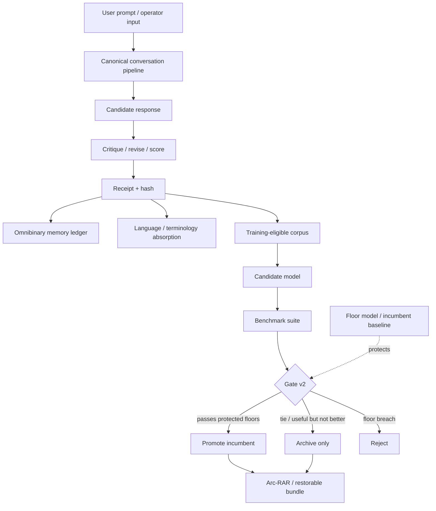

# ARC-Neuron LLMBuilder

<p align="center">
  <strong>Governed local AI model builder for GGUF-oriented candidates, memory receipts, benchmark gates, rollback, and provenance-safe model growth.</strong>
</p>

<p align="center">
  <a href="https://github.com/GareBear99/ARC-Neuron-LLMBuilder/stargazers"></a>
  <a href="./LICENSE"></a>
  <a href="https://www.python.org/downloads/"></a>
  <a href="./scripts/validate_repo.py"></a>
  <a href="./specs/promotion_gate_v2.yaml"></a>
  <a href="./docs/BENCHMARK_PROOF.md"></a>
  <a href="https://github.com/sponsors/GareBear99"></a>
</p>

<p align="center">
  <strong>Local-first AI · Offline LLM builder · GGUF model pipeline · Model governance · AI provenance · Regression-safe promotion · Omnibinary memory · Arc-RAR rollback · ARC ecosystem</strong>
</p>

---

## Why this repo matters

**ARC-Neuron LLMBuilder is a local-first cognition lab for building, evaluating, promoting, and archiving small AI model candidates without losing the evidence trail.** It treats every model as a governed artifact: trained from known data, measured against a benchmark, compared to a floor model, promoted only if it improves, archived with receipts, and restorable by hash.

Most AI projects focus on raw model output. ARC-Neuron focuses on the missing production layer around model growth:

- **model lineage** — where a candidate came from and what data shaped it
- **promotion gates** — whether a candidate is actually better than the incumbent
- **rollback safety** — how to return to a prior brain without guessing
- **memory receipts** — how conversations, corrections, and training events become evidence
- **dataset discipline** — how new training data enters quarantine/candidate lanes before it can affect trusted scores
- **local-first execution** — runs on normal hardware; no cloud dependency required for the core proof loop

> The goal is not just to make a model smarter. The goal is to prove how it became smarter, preserve the path, and prevent regressions from replacing known-good behavior.

---

## Current verified status

This package is intentionally honest about what is proven and what is still staged.

| Area | Current package status |
|---|---|
| Reproducible incumbent | `arc_governed_v10_wave4` |
| Verified incumbent score | `0.9237` |
| Governance gate | Gate v2 |
| Tests | 136 tests |
| Benchmark inventory | 17 benchmark files / 168 total tasks |
| Dataset inventory | 6 dataset files / 120 records |
| v11.3 / wave5 | Candidate/staging lane only until promotion evidence is regenerated |
| 3.0 roadmap | Protected full roadmap integration, dataset manifests, memory protocol, transitional licensing |

See:

- [Production release handoff](./docs/PRODUCTION_RELEASE_HANDOFF.md)
- [Benchmark proof](./docs/BENCHMARK_PROOF.md)
- [Knowledge preservation doctrine](./docs/KNOWLEDGE_PRESERVATION_DOCTRINE.md)
- [v2 candidate isolation policy](./docs/V2_CANDIDATE_ISOLATION_POLICY.md)
- [3.0 roadmap integration](./docs/ARC_NEURON_3_0_ROADMAP_INTEGRATION.md)

---

## What it does in plain English

| You do | ARC-Neuron does |
|---|---|
| Talk to it | Captures conversation evidence, receipts, terminology, and training eligibility |
| Add new data | Routes it through dataset manifests, quarantine/candidate lanes, and provenance checks |
| Train a candidate | Builds a candidate model/artifact without overwriting the incumbent |
| Benchmark it | Scores the candidate across guarded capabilities |
| Promote it | Allows promotion only if Gate v2 accepts the candidate without protected-floor regression |
| Archive it | Bundles lineage and artifacts for rollback and future audit |
| Ask it to prove itself | Runs validation, benchmark, score, promotion, and proof workflows with receipts |

---

## Core capabilities

### Governed model promotion

ARC-Neuron uses a **floor-protected promotion gate**. A new candidate cannot replace the incumbent simply because it performs well on one new dataset. It must avoid regressions across protected capabilities.

Key files:

- [Gate v2 spec](./specs/promotion_gate_v2.yaml)
- [Benchmark schema](./specs/benchmark_schema_v2.yaml)
- [Promotion scripts](./scripts/execution/promote_candidate.py)
- [Scoreboard](./results/scoreboard.json)

### Local GGUF-oriented model pipeline

The project includes Tiny/Small native model tiers, GGUF-oriented paths, adapter boundaries, and a candidate lifecycle intended to grow toward stronger local models without turning governance into an afterthought.

Key files:

- [ARC Tiny model](./arc_tiny/model.py)
- [ARC Small model](./arc_neuron_small/model.py)
- [GGUF path](./docs/ARC_TINY_GGUF_PATH.md)
- [Production GGUF contract](./docs/PRODUCTION_GGUF_BUILD_CONTRACT_2026-04-14.md)
- [Real GGUF production path](./docs/REAL_GGUF_PRODUCTION_PATH_2026-04-14.md)

### Memory, receipts, and provenance

The system is designed around the doctrine that model growth must preserve how knowledge was created. New memory and training events should be traceable, reproducible, and rollback-safe.

Key files:

- [Memory evaluation protocol](./docs/MODEL_MEMORY_EVALUATION_PROTOCOL.md)
- [Knowledge preservation doctrine](./docs/KNOWLEDGE_PRESERVATION_DOCTRINE.md)
- [Intent receipt engine](./arc_core/intent_receipt_engine.py)
- [Context window manager](./arc_core/context_window_manager.py)
- [Omnibinary truth latch](./docs/OMNIBINARY_BIDIRECTIONAL_TRUTH_LATCH.md)

### Dataset roadmap for 3.0

New datasets are planned as governed inputs, not uncontrolled dumps. The roadmap separates ARC-native doctrine data, instruction-following data, reasoning/planning data, lexical simplicity/empathy data, code/tool-use data, safety/licensing data, and memory-continuity tests.

Key files:

- [Dataset acquisition matrix](./docs/DATASET_ACQUISITION_MATRIX_3_0.md)
- [Dataset manifest template](./configs/datasets/dataset_manifest_template.yaml)
- [v2 candidate isolation policy](./docs/V2_CANDIDATE_ISOLATION_POLICY.md)
- [DARPA-style next steps toward Gemma/Claude-class behavior](./docs/DARPA_NEXT_STEPS_TO_GEMMA_CLAUDE_STATE.md)

### SEO-ready public indexing layer

The repo includes metadata and docs for discoverability across GitHub, GitHub Pages, search engines, AI crawlers, and external references.

Key files:

- [SEO indexing playbook](./docs/SEO_INDEXING_PLAYBOOK.md)
- [JSON-LD metadata](./docs/seo_metadata.jsonld)
- [Repository topics](./repo-metadata/repository_topics.txt)
- [Repository description](./repo-metadata/repository_description.txt)
- [Social preview prompt](./repo-metadata/social_preview_prompt.md)
- [robots.txt](./robots.txt)

---

## Quick start

### Install

```bash
git clone https://github.com/GareBear99/ARC-Neuron-LLMBuilder.git
cd ARC-Neuron-LLMBuilder

python3 -m venv .venv
source .venv/bin/activate
pip install -e ".[training]"
python3 scripts/ops/bootstrap_keys.py
```

### Validate the repo

```bash
python3 scripts/validate_repo.py
python3 -m compileall -q .
python3 -m pytest tests -q
```

### Run the incumbent exemplar adapter

```bash
python3 examples/hello.py "Critique a plan that ships without a rollback path."
```

### Run the full benchmark/score/promotion path

```bash
python3 scripts/execution/run_model_benchmarks.py \
  --adapter exemplar \
  --artifact exports/candidates/arc_governed_v10_wave4/exemplar_train/exemplar_model.json \
  --output results/v10_rerun_outputs.jsonl

python3 scripts/execution/score_benchmark_outputs.py \
  --input results/v10_rerun_outputs.jsonl \
  --output results/v10_rerun_scored.json

python3 scripts/execution/promote_candidate.py \
  --scored results/v10_rerun_scored.json \
  --model-name arc_governed_v10_wave4_rerun \
  --skip-bundle
```

### Useful make targets

```bash
make validate          # validate repo structure
make test              # run tests
make counts            # count datasets and benchmarks
make production-verify # staged production verification
make seo-validate      # SEO metadata validation
make full-loop         # train → benchmark → score → gate → bundle → verify
```

---

## Architecture at a glance



Four frozen roles:

1. **Language truth** — words, terms, meanings, source provenance, contradiction flags
2. **Runtime** — conversation pipeline, reflection loop, context handling, receipts
3. **Cognition core** — candidate training, benchmark scoring, promotion gate
4. **Archive layer** — Omnibinary ledger, Arc-RAR bundles, rollback, replay, manifests

Read more:

- [Architecture](./ARCHITECTURE.md)
- [Governance doctrine](./GOVERNANCE_DOCTRINE.md)
- [Stack interface contracts](./docs/STACK_INTERFACE_CONTRACTS.md)
- [Integrated stack](./docs/ARC_NEURON_INTEGRATED_STACK.md)

---

## ARC ecosystem links

ARC-Neuron LLMBuilder is one layer in a broader local-first ARC ecosystem.

| Repo | Role |
|---|---|
| [ARC-Core](https://github.com/GareBear99/ARC-Core) | Authority, event spine, receipts, state provenance |
| [arc-lucifer-cleanroom-runtime](https://github.com/GareBear99/arc-lucifer-cleanroom-runtime) | Deterministic execution kernel and replay substrate |
| [arc-cognition-core](https://github.com/GareBear99/arc-cognition-core) | Cognition doctrine, candidate shaping, evaluation control plane |
| [arc-language-module](https://github.com/GareBear99/arc-language-module) | Governed lexical truth spine and language provenance |
| [omnibinary-runtime](https://github.com/GareBear99/omnibinary-runtime) | Binary mirror, memory ledger, runtime substrate |
| [Arc-RAR](https://github.com/GareBear99/Arc-RAR) | Archive, restore, rollback, manifest-indexed bundles |
| [ARC-Neuron LLMBuilder](https://github.com/GareBear99/ARC-Neuron-LLMBuilder) | Model build loop, benchmark gate, candidate promotion, GGUF path |

Full map: [ECOSYSTEM.md](./ECOSYSTEM.md)

---

## Production roadmap

### Current lane: honest production candidate

- keep `arc_governed_v10_wave4` as reproducible incumbent
- keep v11.3 / wave5 in candidate/staging until evidence regenerates cleanly
- preserve all 3.0 doctrine, dataset, licensing, and memory-roadmap files
- validate before public release claims

### 3.0 protected roadmap

3.0 is planned as the full integration release with stronger licensing, connected dataset manifests, v2 candidate isolation, memory continuity tests, and protected base-model release rules.

Read:

- [3.0 roadmap integration](./docs/ARC_NEURON_3_0_ROADMAP_INTEGRATION.md)
- [Transitional license roadmap](./docs/TRANSITIONAL_LICENSE_ROADMAP.md)
- [License transition notice](./LICENSE_TRANSITIONAL_NOTICE.md)
- [3.0 license checklist](./configs/licensing/three_point_zero_release_license_checklist.yaml)

---

## Recommended GitHub description

> Governed local AI cognition lab for building, benchmarking, and promoting GGUF-oriented model candidates with receipts, rollback, provenance, memory continuity, dataset manifests, and regression-safe gates.

## Recommended GitHub topics

```text
local-ai, offline-ai, llm-builder, gguf, model-governance, ai-provenance, ai-memory, benchmark-gate, regression-testing, model-lineage, rollback, dataset-governance, omnbinary, arc-rar, arc-neuron, python, pytorch, machine-learning, artificial-intelligence, open-source-ai
```

---

## Documentation index

### Start here

- [Quickstart](./QUICKSTART.md)
- [Step-by-step quickstart](./docs/QUICKSTART_STEPBYSTEP.md)
- [Usage](./USAGE.md)
- [Examples](./EXAMPLES.md)
- [FAQ](./FAQ.md)

### Proof and governance

- [Proof](./PROOF.md)
- [Benchmark proof](./docs/BENCHMARK_PROOF.md)
- [Acceptance gates](./docs/ACCEPTANCE_GATES.md)
- [Governance doctrine](./GOVERNANCE_DOCTRINE.md)
- [Production readiness matrix](./docs/PRODUCTION_READINESS_MATRIX.md)

### Model and runtime

- [Model ladder](./docs/MODEL_LADDER.md)
- [Model runtime boundary spec](./docs/MODEL_RUNTIME_BOUNDARY_SPEC.md)
- [ARC-Neuron model family](./docs/ARC_NEURON_MODEL_FAMILY.md)
- [Training stack and GGUF path](./docs/TRAINING_STACK_AND_GGUF_PATH.md)
- [Local backend setup](./docs/LOCAL_BACKEND_SETUP.md)

### 3.0 roadmap

- [Knowledge preservation doctrine](./docs/KNOWLEDGE_PRESERVATION_DOCTRINE.md)
- [v2 candidate isolation policy](./docs/V2_CANDIDATE_ISOLATION_POLICY.md)
- [Dataset acquisition matrix](./docs/DATASET_ACQUISITION_MATRIX_3_0.md)
- [Memory evaluation protocol](./docs/MODEL_MEMORY_EVALUATION_PROTOCOL.md)
- [DARPA next steps](./docs/DARPA_NEXT_STEPS_TO_GEMMA_CLAUDE_STATE.md)

### Public launch / SEO

- [SEO indexing playbook](./docs/SEO_INDEXING_PLAYBOOK.md)
- [GitHub launch checklist](./docs/GITHUB_LAUNCH_CHECKLIST.md)
- [Repository metadata](./repo-metadata/repository_metadata.json)

---

## Community and support

- [GitHub Discussions](https://github.com/GareBear99/ARC-Neuron-LLMBuilder/discussions)
- [Issues](https://github.com/GareBear99/ARC-Neuron-LLMBuilder/issues)
- [Security advisories](https://github.com/GareBear99/ARC-Neuron-LLMBuilder/security/advisories/new)
- [Releases](https://github.com/GareBear99/ARC-Neuron-LLMBuilder/releases)
- [Sponsor Gary Doman / GareBear99](https://github.com/sponsors/GareBear99)

---

## Status and scope

**What this is:** a governed local AI model-building and memory-control plane for candidate training, benchmark scoring, promotion, rollback, and provenance preservation.

**What this is not:** a frontier-scale Claude/Gemini/GPT replacement today. The included model tiers are deliberately small reference brains. The major contribution is the governed loop around model growth: dataset discipline, scoring, receipts, lineage, rollback, and promotion safety.

**Best mental model:** the shell is production-oriented; the brain is the research lane. External GGUF/local backends can plug into the governance machinery while ARC-native candidates continue to grow.

---

## Citation

```bibtex
@software{arc_neuron_llmbuilder_2026,
  author  = {Doman, Gary},
  title   = {ARC-Neuron LLMBuilder: Governed Local AI Model Builder with Receipts, Rollback, and Provenance-Safe Promotion},
  year    = {2026},
  url     = {https://github.com/GareBear99/ARC-Neuron-LLMBuilder}
}
```

Full metadata: [CITATION.cff](./CITATION.cff)

---

## License

Current public release materials are under [MIT](./LICENSE). The roadmap also includes a [transitional license notice](./LICENSE_TRANSITIONAL_NOTICE.md) and [3.0 protected licensing roadmap](./docs/TRANSITIONAL_LICENSE_ROADMAP.md) for future full base-model releases, dataset-connected releases, and commercial derivative restrictions.

---

## One-line verdict

**ARC-Neuron LLMBuilder is a local-first AI build system that does not just chase better answers — it preserves the evidence of how every better answer was earned.**
