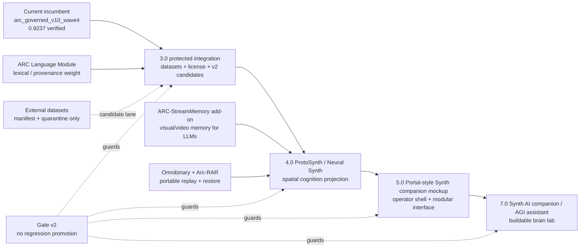

# ARC-Neuron Next Integration Graph

This document mirrors the public README graph for the next roadmap stage. It is intentionally conservative: the current incumbent remains protected while new modules attach as governed add-ons.

## Roadmap lanes

| Horizon | Function | Boundary |
|---|---|---|
| Current | `arc_governed_v10_wave4` incumbent | Reproducible incumbent; not overwritten by roadmap data. |
| 3.0 | Protected dataset / license / v2 candidate integration | External datasets require manifest, license review, hashing, quarantine, benchmark proof, and no-regression checks. |
| 4.0 | ProtoSynth / Neural Synth projection | Spatial/visual cognition interface, not a replacement for the model gate. |
| ARC-StreamMemory | Visual/video memory add-on | Add-on for all LLMs and ARC-style systems; produces source-spine memory modules. |
| 5.0 | Portal-style Synth companion mockup | Modular companion shell and operator prototype. |
| 7.0 | Working Synth AI companion / AGI assistant / buildable brain lab | Long-horizon target for a usable companion and inspectable cognition lab. |

## Non-negotiable boundary

No future layer bypasses Gate v2, dataset manifests, source hashing, rollback evidence, or the incumbent/floor model separation.
