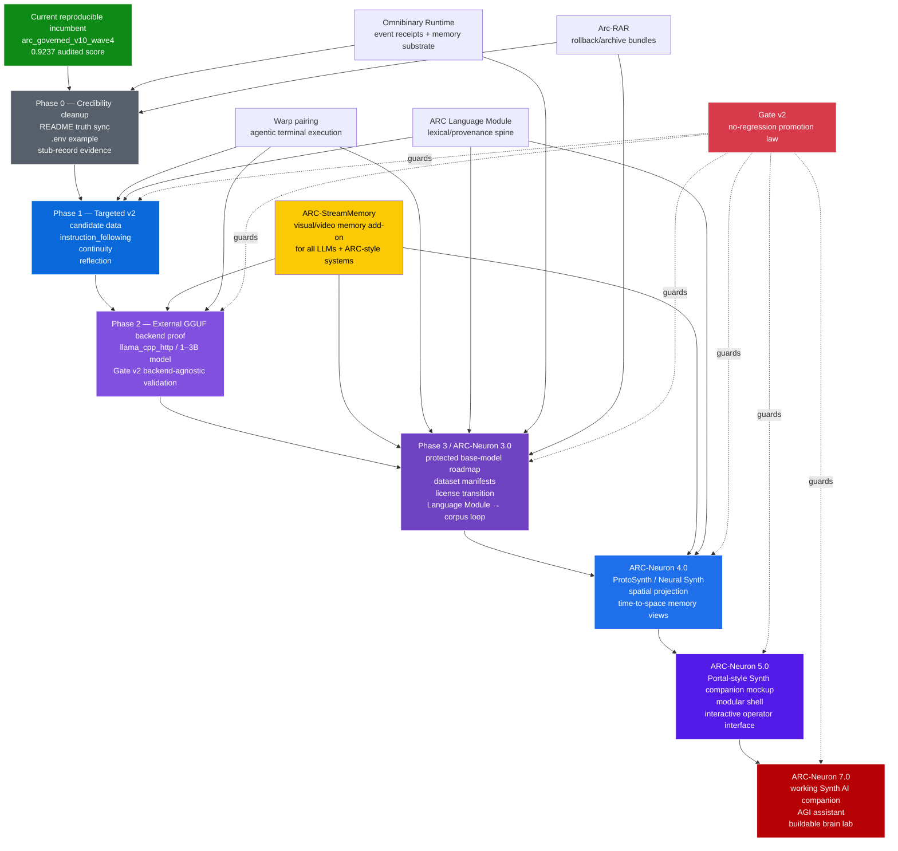

# Next public update roadmap phases

This graph is the next public-facing roadmap map. It keeps the current v10 proof base intact, then labels the next public update phases from credibility cleanup through targeted data, external backend proof, protected 3.0 integration, and the later Synth horizons. These are roadmap phases, not claims that future layers are already trained into the incumbent.

| Phase | Public label | Purpose |
|---|---|---|
| Current | v10 audited incumbent | Preserve the reproducible proof base before new changes. |
| Phase 0 | Credibility cleanup | Fix stale README facts, missing env example, and stub-record evidence. |
| Phase 1 | Targeted v2 candidate data | Add surgical examples for weak lanes without polluting incumbent scoring. |
| Phase 2 | External GGUF backend proof | Prove Gate v2 works with a real 1–3B GGUF backend through `llama_cpp_http`. |
| Phase 3 / 3.0 | Protected base-model integration | Dataset manifests, license transition, v2 isolation, and Language Module → corpus loop. |
| 4.0 | ProtoSynth / Neural Synth projection | Spatial/visual cognition layer and time-to-space memory projection. |
| 5.0 | Portal-style Synth companion mockup | Full modular companion shell and operator-facing mockup. |
| 7.0 | Working Synth AI / brain lab | Synth AI companion, AGI assistant, and buildable brain lab target. |

Boundary: these phases are roadmap labels. They do not bypass Gate v2, dataset manifests, rollback evidence, or incumbent protection. ARC-StreamMemory, Warp pairing, ProtoSynth/Neural Synth, and the Synth companion shell attach around the governed ARC-Neuron loop; they do not silently replace the current incumbent.

Standalone roadmap doc: [NEXT_PUBLIC_UPDATE_ROADMAP_PHASES.md](./docs/NEXT_PUBLIC_UPDATE_ROADMAP_PHASES.md).

