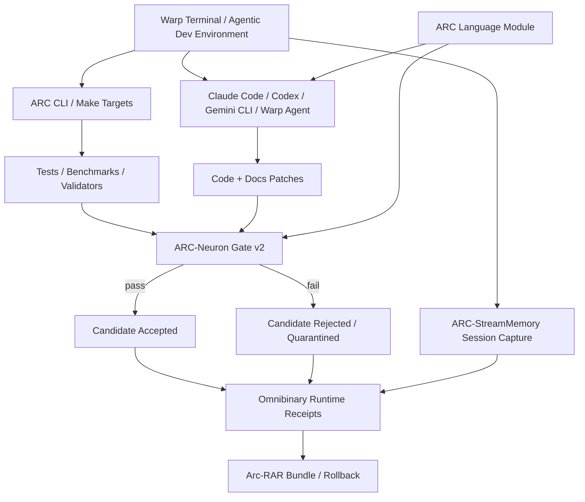

# Warp pairing — agentic terminal execution with ARC governance

ARC-Neuron can pair with agentic terminals such as [Warp](https://github.com/warpdotdev/warp). Warp supplies the terminal-native execution surface; ARC-Neuron supplies the governance law around candidates, benchmarks, dataset manifests, receipts, rollback, and source-spine continuity.

This is an integration pattern, not a claim that Warp is part of ARC-Neuron. The clean boundary is:

- **Warp**: run commands, inspect terminal blocks, drive agentic coding sessions, and manage development workflows.
- **ARC-Neuron**: verify candidates, enforce Gate v2, protect incumbent measurements, preserve receipts, and block unsafe promotion.
- **ARC-StreamMemory**: capture terminal/session/visual evidence for future AI-readable review.
- **Omnibinary Runtime**: preserve command/event/receipt history as an auditable memory substrate.
- **Arc-RAR**: package reproducible rollback states and source-spine bundles.
- **ARC Language Module**: normalize ARC-specific terminology, project language, and provenance vocabulary so agents do not reinterpret protected words like candidate, incumbent, Gate v2, receipt, or source spine.



## Why it matters

Agentic terminals are powerful, but they can also make fast destructive changes: wrong-repo commits, overwritten docs, hidden regressions, unreviewed datasets, and false promotion claims. ARC-Neuron provides the control layer around that speed.

A safe workflow looks like this:

```text
issue or operator intent
→ Warp/agent proposes patch
→ ARC commands run tests and benchmarks
→ Gate v2 compares candidate against incumbent floors
→ Omnibinary records command/event receipts
→ Arc-RAR packages rollback state
→ ARC-StreamMemory captures session evidence
→ candidate is accepted, rejected, or quarantined
```

## Example command surface

```bash
make validate
make test
make counts
make candidate-gate
make bundle-candidate CANDIDATE=<name>
make verify-store
```

## Boundary

This pairing does not bypass ARC governance. Warp or any external CLI agent can execute commands, but model promotion, dataset intake, benchmark updates, and incumbent replacement remain governed by ARC-Neuron receipts and Gate v2 rules.
